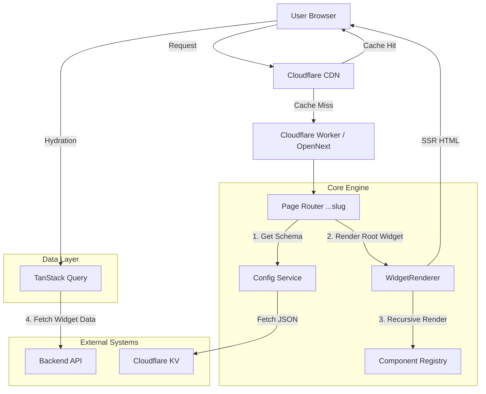
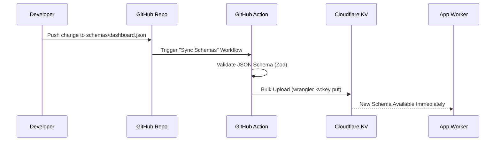

# Production Architecture: Schema-Driven UI Platform

## 1. Executive Summary

This document defines the architectural blueprint for the new **Production App** (`apps/production-app`).

**Core Philosophy:**
> "Everything is a Widget."

We are moving away from rigid "Page Templates" (like `list-page`, `detail-page`) to a **Composable Layout System**. A "List Page" is simply a generic layout containing a `FilterWidget` and a `TableWidget`. A "Dashboard" is a layout containing a `GridSection` with `MetricWidgets`.

---

## 2. System Architecture (Cloudflare OpenNext)

### 2.1 High-Level Diagram



### 2.2 Diagram Flow Explanation

1.  **Request & Routing:** The user requests a URL (e.g., `/dashboard/claims`). Cloudflare CDN attempts to serve a cached response. On a miss, the request is forwarded to the Cloudflare Worker running OpenNext.
2.  **Schema Resolution:** The `Page Router` extracts the slug (`dashboard/claims`) and calls the `ConfigLoader`. This service fetches the corresponding JSON schema from **Cloudflare KV**, ensuring extremely low latency (edge-local reads).
3.  **Recursive Rendering:** The `LayoutEngine` receives the JSON schema. It starts at the root widget and recursively resolves each child using the `Component Registry`.
4.  **SSR & Hydration:** The server returns fully formed HTML. On the client, React hydrates the components.
5.  **Granular Data Fetching:** Once hydrated, individual "Smart Widgets" use `TanStack Query` to fetch their specific data.

---

## 3. Deployment Pipeline: GitHub to Cloudflare KV

To achieve "Schema-Driven" agility, we need a robust pipeline that syncs JSON config files from the repository to the edge storage (KV) without requiring a full application rebuild.

### 3.1 The "Schema Sync" Workflow

We treat the `schemas/` directory in the repo as the "Source of Truth".



### 3.2 Implementation Details

1.  **Validation Step:** Before uploading, the CI pipeline runs a validation script using `zod`. This ensures no broken or malformed JSON ever reaches production.
2.  **KV Namespace Strategy:**
    *   **Preview:** PRs sync to a `PREVIEW_SCHEMAS` namespace (keyed by git hash or PR ID).
    *   **Production:** Main branch syncs to `PROD_SCHEMAS` namespace.
3.  **Key Naming Convention:**
    *   File: `schemas/claims/list.json`
    *   KV Key: `page:claims/list`

---

## 4. The Unified "Widget" Protocol

### 4.1 Universal Schema Interface
```typescript
interface WidgetConfig {
  id: string;
  type: string; // Registry Key (e.g., "table", "grid", "card")
  
  // Visual Configuration
  props?: Record<string, any>;
  
  // Layout Constraints
  layout?: {
    colSpan?: number;
    hidden?: boolean; 
  };
  
  // Data Binding
  dataSource?: {
    api?: { endpoint: string; method: "GET" | "POST" };
    refreshInterval?: number;
    valueKey?: string; 
  };
  
  // Recursion
  children?: WidgetConfig[]; 
}
```

### 4.2 Recursive Parser (`WidgetRenderer`)

```typescript
// src/components/registry/WidgetRenderer.tsx
export const WidgetRenderer = ({ config }: { config: WidgetConfig }) => {
  const Component = registry.get(config.type);
  if (!Component) return <ErrorWidget message={`Unknown: ${config.type}`} />;

  return (
    <SmartDataWrapper config={config}>
       <Component {...config.props}>
          {config.children?.map(child => (
            <WidgetRenderer key={child.id} config={child} />
          ))}
       </Component>
    </SmartDataWrapper>
  );
};
```

---

## 5. Layout Primitives (Deep Dive)

The core strength of this system is its layout primitives. They replace rigid templates with composable blocks.

### 5.1 Stack Layout (`stack-layout`)
**Concept:** A Flexbox container. It is the fundamental building block for vertical or horizontal lists of widgets.
**Visual:**
```
[ Stack (Column) ]
  ├── [ Header Widget ]
  ├── [ Filter Widget ]
  └── [ Table Widget  ]
```
**Transformation Logic:**
The old `RecordListPage` was essentially a hardcoded Stack Layout: `<div><Header /><Filters /><Table /></div>`.
In the new system, we simply configure a `stack-layout` widget with `direction: "column"`.

**Schema Example:**
```json
{
  "type": "stack-layout",
  "props": {
    "direction": "column", // 'row' | 'column'
    "gap": 4,              // Tailwind gap scale
    "align": "start",      // 'start' | 'center' | 'end' | 'stretch'
    "justify": "between"   // 'start' | 'center' | 'between'
  },
  "children": [ /* Child widgets */ ]
}
```

### 5.2 Grid Layout (`grid-layout`)
**Concept:** A CSS Grid container. Used for arranging uniform items in 2D space (Dashboards, Forms).
**Visual:**
```
[ Grid (4 Columns) ]
  ├── [ Metric 1 ] [ Metric 2 ] [ Metric 3 ] [ Metric 4 ]
```
**Transformation Logic:**
The old `DashboardSection` had a `columns` prop. This maps directly to `grid-layout`.
The old logic `section.columns === 2 ? "md:grid-cols-2" ...` is now handled by the generic `GridLayout` component using standard Tailwind classes.

**Schema Example:**
```json
{
  "type": "grid-layout",
  "props": {
    "columns": { "sm": 1, "md": 2, "lg": 4 }, // Responsive columns
    "gap": 4
  },
  "children": [ /* Metric Cards */ ]
}
```

---

## 6. Comparative Analysis: Current Mocks vs. New Schema

This section demonstrates exactly how existing mocks are transformed into the new `Widget` structure using real JSON examples.

### 6.1 Dashboard Transformation

**Strategy:**
The old `dashboard-page-config-mock.ts` defined a `sections` array where each section had a `widgets` array.
In the new schema, a **Section** becomes a `section-group` widget, which wraps a `grid-layout` widget.

**Old Config Snippet (`dashboard-page-config-mock.ts`):**
```typescript
{
  pageType: "dashboard",
  sections: [
    {
      title: "Key Metrics",
      columns: 4,
      widgets: [
        { widgetType: "metric", label: "Total Claims", value: 120 }
      ]
    }
  ]
}
```

**New Schema JSON:**
```json
{
  "id": "dashboard-page",
  "type": "stack-layout",
  "props": { "gap": 8 },
  "children": [
    {
      "type": "section-group",
      "props": { "title": "Key Metrics" },
      "children": [
        {
          "type": "grid-layout",
          "props": { "columns": 4, "gap": 4 },
          "children": [
            {
              "type": "metric-card",
              "id": "total-claims",
              "props": { "label": "Total Claims", "value": 120 }
            }
          ]
        }
      ]
    }
  ]
}
```

### 6.2 List View Transformation

**Strategy:**
The old `claims-list-page-config-mock.ts` had top-level properties `filters` and `table`.
In the new schema, we treat the page as a `stack-layout`. The `filters` array moves to the props of a `filter-bar` widget. The `table` logic moves to a `data-table` widget.

**Old Config Snippet (`claims-list-page-config-mock.ts`):**
```typescript
{
  pageType: "record-list",
  header: { title: "Claims" },
  filters: [ { id: "status", "type": "select" } ], // Top-Level
  table: { columns: [...] } // Top-Level
}
```

**New Schema JSON:**
```json
{
  "id": "claims-list",
  "type": "stack-layout",
  "props": { "gap": 4 },
  "children": [
    {
      "type": "page-header",
      "props": { "title": "Claims" }
    },
    {
      "type": "filter-bar",
      "props": {
        "filters": [
          { "id": "status", "type": "select", "label": "Status", "options": ["Open", "Closed"] }
        ]
      }
    },
    {
      "type": "data-table",
      "dataSource": { "api": { "endpoint": "/api/claims", "method": "GET" } },
      "props": {
        "columns": [
          { "header": "Claim #", "accessorKey": "claimNumber" },
          { "header": "Status", "accessorKey": "status" }
        ]
      }
    }
  ]
}
```

### 6.3 Detail View Transformation

**Strategy:**
The old `claims-detail-page-config-mock.ts` used a `tabs` array.
In the new schema, we use a `tabs-container` widget. Each conceptual tab becomes a `tab-panel` widget inside the container's `children`.

**Old Config Snippet (`claims-detail-page-config-mock.ts`):**
```typescript
{
  pageType: "record-details",
  summary: { fields: [...] },
  tabs: [
    { id: "overview", label: "Overview" },
    { id: "policy", label: "Policy" }
  ]
}
```

**New Schema JSON:**
```json
{
  "id": "claim-detail",
  "type": "stack-layout", // Vertically stack Header, Summary, Tabs
  "children": [
    {
      "type": "key-value-grid", // Replaces "summary"
      "dataSource": { "valueKey": "claim" },
      "props": {
        "fields": [ { "label": "Status", "key": "status" } ]
      }
    },
    {
      "type": "tabs-container",
      "children": [
        {
          "type": "tab-panel",
          "props": { "label": "Overview", "value": "overview" },
          "children": [
            // Can contain GRIDS, CHARTS, anything because it's recursive!
            { "type": "grid-layout", "children": [...] }
          ]
        },
        {
          "type": "tab-panel",
          "props": { "label": "Policy", "value": "policy" },
          "children": [
             { "type": "form-viewer", "props": { "formId": "policy-form" } }
          ]
        }
      ]
    }
  ]
}
```

---

## 7. The Data Layer (React Query Integration)

Every widget that needs data uses the shared `useSmartQuery` hook.

```typescript
// hooks/useSmartQuery.ts
export function useSmartQuery(dataSource?: DataSourceConfig) {
  const { api, valueKey, refreshInterval } = dataSource || {};

  return useQuery({
    queryKey: api ? [api.endpoint, api.method, api.params] : ['no-api'],
    queryFn: async () => {
      if (!api) return null;
      const res = await fetch(api.endpoint, { method: api.method, body: api.params });
      return res.json();
    },
    refetchInterval: refreshInterval,
    enabled: !!api, 
    initialData: valueKey ? getContextData(valueKey) : undefined
  });
}
```

---

## 8. Action Handling & Transformations

### 8.1 The `useActionHandler` Hook

A single hook handles all user interactions defined in the schema.

```typescript
// hooks/useActionHandler.ts
export const useActionHandler = () => {
  const router = useRouter();
  const { mutateAsync } = useMutation();
  const { openModal } = useModalStore();

  return async (action: ActionConfig) => {
    switch (action.type) {
      case 'navigate': router.push(resolveRoute(action.target)); break;
      case 'api-mutation': 
        await mutateAsync(action.api);
        queryClient.invalidateQueries({ queryKey: [action.refreshKey] });
        break;
      case 'open-modal': openModal(action.target, action.props); break;
    }
  };
};
```
### 8.2 Transformation: Old Actions -> New Actions

The "Action Renderer" concept shifts from hardcoded switch statements in page components to a generic handler used by *any* widget.

**Old Approach (Hardcoded & Scattered):**
Previously, `RecordListPage.tsx` had a specific function `handleRowAction` that manually checked `action.intent`:

```typescript
// Old handler in RecordListPage.tsx
const handleRowAction = (action, row) => {
  if (action.intent === 'view') {
    history.push(action.actionProps.route.replace(':id', row.id));
  } else if (action.intent === 'delete') {
    setShowDeleteModal(true);
  }
};
```

**New Approach (Centralized & Declarative):**
Now, the "Renderer" is just the `useActionHandler` hook. Any widget (Button, Menu Item, Row) simply calls this hook with the config.

**JSON Transformation Table:**

| Feature | Old Config (`intent`) | New Config (`action`) |
| :--- | :--- | :--- |
| **View/Nav** | `{ intent: "view", actionProps: { route: "/claims/:id" } }` | `{ type: "navigate", target: "/claims/:id" }` |
| **Delete** | `{ intent: "delete", actionProps: { api: "..." } }` | `{ type: "api-mutation", method: "DELETE", api: "..." }` |
| **Edit** | `{ intent: "edit", actionProps: { formId: "edit-form" } }` | `{ type: "open-modal", target: "edit-form" }` |

This decouples the visual representation (Button vs Icon vs Menu) from the logic (Navigation vs Mutation).


---

## 9. Quality Assurance & CI/CD Strategy

We employ a 4-layer testing pyramid to ensure production grade stability.

### 9.1 Layer 1: Static Analysis & Schema Validation
**Tooling:** `tsc`, `eslint`, `zod`
**Trigger:** Pre-commit & CI (Pull Request)

1.  **TypeScript:** Ensures code correctness.
2.  **Zod Schema Tests:** Every JSON file in `schemas/` is validated against the master `PageConfig` Zod schema.
    *   *Check:* Are all required props present? Are nested children valid?
    *   *Fail:* If a developer adds a `metric-card` but forgets the `dataSource`, the build fails.

```typescript
// scripts/validate-schemas.ts
const schemas = glob.sync('./schemas/**/*.json');
schemas.forEach(file => {
  const json = readJson(file);
  const result = PageConfigSchema.safeParse(json);
  if (!result.success) throw new Error(`Invalid Schema: ${file}`);
});
```

### 9.2 Layer 2: Unit & Component Testing
**Tooling:** `vitest`, `react-testing-library`
**Trigger:** CI (Pull Request)

1.  **Utilities (`src/lib`):** Test helper functions like `formatCurrency`, `resolveRoute`, `cn`.
2.  **Widgets (`src/components/widgets`):** Test individual widgets in isolation.
    *   *Mock:* Inject mock `config` props.
    *   *Assert:* Verify the widget renders the label, icon, and correct value state.
    *   *Behavior:* Verify clicking a button calls the mocked `actionHandler`.

### 9.3 Layer 3: Integration Testing (The "Renderer")
**Tooling:** `vitest`
**Trigger:** CI (Pull Request)

1.  **Registry Integration:** Verify that `WidgetRenderer` correctly resolves string keys to components.
2.  **Recursive Rendering:** Pass a nested schema (stack -> grid -> card) and verify the full DOM tree is generated correctly.
3.  **Data Hook Integration:** Mock the API response and verify `useSmartQuery` updates the component state from `loading` to `success`.

### 9.4 Layer 4: E2E Regression Testing
**Tooling:** `playwright`
**Trigger:** CI (Merge to Main / Release)

1.  **Critical Paths:**
    *   Login -> Dashboard Load -> Verify Metrics are visible.
    *   Dashboard -> Click Claim -> Detail Page Loads.
    *   List Page -> Filter "Closed" -> Verify URL param updates.
2.  **Visual Regression:** Snapshot testing for widely used widgets.

---

## 10. Environment Strategy & Pipelines

We maintain striation between environment configurations to ensure safe promotions.

### 10.1 Environments

| Env | URL | Purpose | Data Source |
| :--- | :--- | :--- | :--- |
| **Preview** | `pr-123.app.dev` | PR Validation | Mock / Dev API |
| **Dev** | `app.dev.com` | Internal Testing | Dev API |
| **UAT** | `app.uat.com` | User Acceptance | Staging API |
| **Prod** | `app.com` | Production | Prod API |

### 10.2 CI/CD Pipeline (GitHub Actions)

**A. The Code Pipeline (`deploy-app.yml`)**
1.  **PR Opened:**
    *   Run Lint, Typecheck, Schema Validation.
    *   Run Unit/Integration Tests (`vitest`).
    *   Deploy to **Cloudflare Workers Preview**.
    *   Run E2E (`playwright`) against Preview URL.
2.  **Merge to Main:**
    *   Deploy to **Dev** Environment.
3.  **Tag Release v1.0:**
    *   Promote Dev build to **Prod**.

**B. The Schema Pipeline (`sync-schemas.yml`)**
*Decoupled from code deployment.*

1.  **Push to `schemas/`:**
    *   Validate JSONs against Zod.
    *   Determine Environment (Branch Name -> KV Namespace).
    *   **Dev:** Sync to `DEV_SCHEMAS` KV.
    *   **Main:** Sync to `PROD_SCHEMAS` KV.

---

## 11. Implementation Plan

1.  **Project Init:** Initialize `apps/production-app`.
2.  **Core:** Build `WidgetRegistry` and recursive `WidgetRenderer`.
3.  **Pipeline:** Create `.github/workflows/deploy-schemas.yml` for KV sync.
4.  **Widgets:** Port `MetricWidget` and create `GridWidget`.
5.  **Proof of Concept:** Render a Dashboard driven by local JSON (simulating KV).
