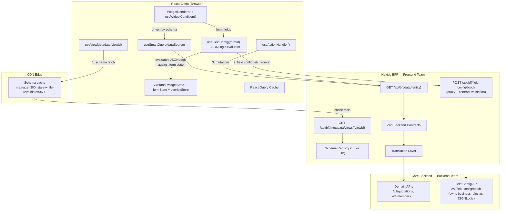

# ADR-002: Field-Level Conditional Logic and Architecture Scope

**Status:** Accepted
**Date:** 2026-04-06
**Authors:** Frontend Team + Backend Team

> **Note:** This ADR references `METADATA_DRIVEN_UI_FINAL.md` throughout as its foundation document. That document has been superseded by [`ARCHITECTURE.md`](./ARCHITECTURE.md) and [`KEYSTONE-UI-SYSTEM-DESIGN.md`](./KEYSTONE-UI-SYSTEM-DESIGN.md). The field logic decisions recorded here remain current — they are implemented as Layer 5 (Field Config API) of the current architecture.

---

## Table of Contents

1. [What Drove This ADR](#1-what-drove-this-adr)
2. [Decision 1 — BFF Stays; S3/DMS Is a Valid Backing Store](#2-decision-1--bff-stays-s3dms-is-a-valid-backing-store)
3. [Decision 2 — Architecture Scope: UI Composition Layer, Not Full Workbench](#3-decision-2--architecture-scope-ui-composition-layer-not-full-workbench)
4. [Decision 3 — Field Conditional Logic via Field Config API + JSONLogic](#4-decision-3--field-conditional-logic-via-field-config-api--jsonlogic)
5. [What Stays in Schema vs. What Moves to Field Config](#5-what-stays-in-schema-vs-what-moves-to-field-config)
6. [Updated Architecture Diagram](#6-updated-architecture-diagram)
7. [Known Pitfalls and Mitigations](#7-known-pitfalls-and-mitigations)
8. [Migration Plan Additions](#8-migration-plan-additions)

---

## 1. What Drove This ADR

Three independent inputs arrived after `METADATA_DRIVEN_UI_FINAL.md` was accepted:

### 1.1 Team Question — "Do we really need the BFF?"

The suggestion: if the backend has a document management system, serve schemas and translation maps directly from S3 (with versioning and a validation layer). Fetch and assemble them in the browser. Skip the BFF serving layer.

### 1.2 Product Feedback (Domain Assessment)

Full text in `UI Architecture Assessment.md`. One-line verdict: **this is a good UI composition layer — do not mistake it for a full workbench interaction layer.**

The assessment correctly identifies that insurer-grade workbenches (quotation, underwriting, PAS, accounting, CCM, claims/legal) need:
- Workflow-aware action capability contracts (not UI-derived conditions)
- Screen bootstrap APIs (coherent snapshot, not per-widget fetches)
- Purpose-built domain widgets that metadata arranges but does not replace

### 1.3 Backend Discussion — Field Conditional Logic

**Problem identified:** hardcoding validation, visibility, and field rules in schemas is brittle. Any change to business logic — a new field dependency, a changed validation rule, a new dropdown value — requires a schema update. Rules that are known upfront and may change independently of the UI structure should not live in the schema.

**Decision made jointly with Backend Team:**
- Page structure stays in schema
- Field-level conditional logic (visible, editable, required, list of values, validation) is served by a **Field Config API**
- Fields are identified by a **canonical path key**: `page.widget.fieldName` (e.g. `quotation.benefitForm.premiumAmt`)
- The API response returns rules as **JSONLogic expressions**, evaluated client-side
- JSONLogic (`jsonlogic.com`) is agreed upon and already partially implemented

---

## 2. Decision 1 — BFF Stays; S3/DMS Is a Valid Backing Store

### The question

Can we remove the BFF entirely, serving schemas and translation maps from S3 directly to the browser?

### Answer: The BFF serving layer is not optional; its storage backend can be S3

The BFF does five things that S3 cannot:

| Function | S3/DMS | BFF |
|----------|--------|-----|
| **Context-aware schema resolution** | Cannot — S3 serves static files. Selecting the right schema for `{tenantId, role, lob}` requires server-side computation (the specificity query in §9 of the final doc). Pre-baking one file per context combination causes combinatorial explosion as dimensions grow. | Yes — runs the JSONB specificity query server-side |
| **Auth boundary** | Cannot — backend URLs and credentials would be in the browser | Yes — backend is invisible to the browser |
| **Translation enforcement** | Cannot — domain→display mapping in the browser means domain vocabulary in the JS bundle; label changes require a frontend deploy | Yes — maps stay server-side |
| **Param normalization** | Cannot — both vocabularies must exist in the browser | Yes — `mainStatus=Approved` → `status=APPROVED` at the BFF |
| **Field Config API proxy** | Cannot — the Field Config API (§4) needs auth, rate limiting, and contract enforcement | Yes |

### What S3/DMS is excellent for

S3 is a perfectly valid **backing store** for the BFF's schema registry, in place of the filesystem or a DB:

```
S3 bucket: keystone-schemas/
├── quotations-list/
│   ├── default.json          ← global fallback
│   └── auto-claims.json      ← tenant override
├── dashboard/
│   └── default.json
└── ...
```

The BFF metadata endpoint reads from S3 at request time, does context resolution, validates, and serves. S3's built-in versioning and the validation-layer-on-top idea are both compatible with this model — they replace the `view_schemas` DB table (Phase 6) with an S3-backed equivalent.

**Recommendation:** Use S3 as the schema backing store instead of the DB if the team prefers to avoid operating a DB. The BFF serving layer (context resolution, auth, translation, Field Config proxy) must still exist. The storage is interchangeable; the serving logic is not.

---

## 3. Decision 2 — Architecture Scope: UI Composition Layer, Not Full Workbench

### The scope is narrowed, not reduced in value

The metadata-driven architecture in `METADATA_DRIVEN_UI_FINAL.md` is the right foundation for approximately half the platform surface. It is not, and should not attempt to be, the full answer for insurer-grade workbenches.

The target state is a **four-layer architecture**, with the current document covering Layer A well:

```
┌─────────────────────────────────────────────────────────────────────┐
│ Layer A — Metadata Shell (current scope)                            │
│ Owns: page layout, regions, widget placement, standard actions,     │
│ table columns, filter bars, light visibility conditions,            │
│ tenant/role/LOB/locale variants                                     │
├─────────────────────────────────────────────────────────────────────┤
│ Layer B — Workflow Contract (next phase, for workbench screens)     │
│ Owns: workflow stage, task ownership, allowed actions,              │
│ blocking reasons, evidence requirements, draft state,               │
│ maker-checker state, async jobs, audit requirements                 │
├─────────────────────────────────────────────────────────────────────┤
│ Layer C — Domain Widget Contracts                                   │
│ Owns: props for purpose-built widgets, event contracts,             │
│ region-specific view models, diff/compare payloads,                 │
│ explainability payloads                                             │
├─────────────────────────────────────────────────────────────────────┤
│ Layer D — Domain APIs / Orchestration                               │
│ Owns: business truth, persistence, workflow progression,            │
│ event emission, transactional integrity, system-of-record state     │
└─────────────────────────────────────────────────────────────────────┘
```

### Where the current architecture is the right answer

These surfaces are primarily compositional. Metadata drives them well:

- **Portals** (member, broker, employer, partner) — strongest fit, especially with context dimensions
- **Operational queues and inboxes** — pending quotations, claims queues, issuance queues, recon queues
- **List-detail pages** — catalog browsers, template lists, policy lists, reference-data screens
- **Dashboards and KPI screens**
- **Standard intake forms** — servicing requests, standard claim notifications
- **Admin/configuration screens**

### Where the architecture must be extended

These surfaces need the Workflow Contract layer (Layer B) and purpose-built domain widgets (Layer C). The metadata shell arranges them — it does not replace them.

| Module | Shell metadata handles | Needs beyond metadata |
|--------|----------------------|----------------------|
| Quotation / underwriting workbench | Layout, queue, summary cards, standard nav | Census review grid, scenario studio, pricing trace, approval pack preview, `canApprove`/`blockingReasons` from workflow contract |
| PAS servicing cockpit | Policy lists, servicing forms, document lists | Endorsement impact compare, transaction timeline, issuance packet review |
| Accounting recon | Summary dashboards, posting queues | Journal drilldown, recon break desk, exception clustering grid, batch closure controls |
| CCM | Template lists, communication queues | Preview pane, variable inspector, multi-channel proofing |
| Claims / legal | Case queues, document tables, note sections | Claim chronology, liability calculator, settlement recommendation panel |
| Rules authoring | Shell, nav, approval queues, history | Decision table editor, simulation trace, diff viewer, publish console |

### Critical guardrail on schema context

The product feedback correctly flags a failure mode: **do not put volatile transactional state into schema context dimensions.**

```
Safe context (slow-changing, audience-stable):
  tenant, role, lob, locale, portal type, product family

Unsafe context (transactional, volatile):
  quote status, endorsement subtype, claim severity, approval stage, workflow step
```

Transactional state drives **workflow data and action capability** — not whole-schema forks. A quote moving from `PENDING_PRICING` to `REFERRED` should never require two separate schema variants. The same schema should respond to the workflow state through the Workflow Contract (Layer B) — not through schema explosion.

### Action capability: a hard architectural line

For regulated workflows, UI-derived conditions are not sufficient to gate material actions. The following must come from an explicit capability payload returned by the backend/BFF:

```json
{
  "actions": {
    "approveQuote":     { "enabled": false, "reasons": ["pricing_not_finalized"] },
    "requestEvidence":  { "enabled": true },
    "issuePolicy":      { "enabled": false, "reasons": ["maker_checker_pending"] },
    "settleReserve":    { "enabled": false, "reasons": ["required_evidence_missing"] }
  }
}
```

The schema condition system (`widgetState`, `appContext`, `serverState`) is for **convenience UI logic**: showing a section for a role, hiding a widget until a filter is applied, toggling a panel after an upload. It is not for gating transactions that have audit, compliance, or financial consequences. Those gates must be enforced server-side regardless of what the UI shows.

---

## 4. Decision 3 — Field Conditional Logic via Field Config API + JSONLogic

This is the most significant architectural decision in this ADR. It changes how form field behavior is governed.

### 4.1 The problem with schema-hardcoded field logic

The current architecture supports widget-level visibility conditions in the schema. The natural extension would be to add field-level conditions there too:

```json
{
  "id": "premium-amount",
  "type": "currency-input",
  "layout": {
    "condition": {
      "source": "widgetState",
      "field": "coverType",
      "operator": "eq",
      "value": "comprehensive"
    }
  }
}
```

This is **brittle** for three reasons:

1. **Logic lives in the wrong place.** Whether `premiumAmt` is visible when `coverType = comprehensive` is a business rule, not a layout rule. The business owns it; the schema is not the right home.
2. **Any rule change is a schema update.** A new product line introduces a new cover type. The condition breaks or needs updating. A schema deploy is required for a domain rule change.
3. **It cannot encode complex rules.** Validation ranges, cross-field dependencies, conditional list-of-values, required-if chains — these cannot be expressed with the simple `{ operator, field, value }` condition model.

### 4.2 The decision: Field Config API

For every form field, a **Field Config API** returns the complete behavioral specification for that field as **JSONLogic expressions**. The frontend evaluates these expressions against the current form state at runtime.

```
┌───────────────────────────────────────────────────────────────────┐
│ Schema (BFF)                                                      │
│ Owns: field exists, label, type, position                         │
│ Does NOT own: when it's visible, required, editable, what values  │
└───────────────────────────────────────────────────────────────────┘
                         ↓ at form init
┌───────────────────────────────────────────────────────────────────┐
│ Field Config API (Backend → BFF proxy)                            │
│ Owns: visible, editable, required, listOfValues, validation       │
│ Expressed as JSONLogic — evaluated client-side                    │
└───────────────────────────────────────────────────────────────────┘
                         ↓ at runtime
┌───────────────────────────────────────────────────────────────────┐
│ FormContainer (Client)                                            │
│ Evaluates JSONLogic against current form state per render cycle   │
│ Re-evaluates on every field change — reactive, not static         │
└───────────────────────────────────────────────────────────────────┘
```

### 4.3 Canonical Field Path

Every field is identified by a dotted canonical path:

```
{page}.{widget}.{fieldName}

Examples:
  quotation.benefitForm.coverType
  quotation.benefitForm.premiumAmt
  claimIntake.memberDetails.dateOfBirth
  pasServicing.endorsementForm.effectiveDate
```

**Conventions:**
- All segments are camelCase
- Path uniquely identifies a field across the entire application
- The path is the primary key for the Field Config API request
- Schema authors set `props.path` on every form field widget using this convention
- This path is also the key in the Zustand form state and the JSONLogic data object

### 4.4 Field Config API Specification

```
POST /api/bff/field-config/batch

Auth:    Session cookie (context resolved server-side — tenantId, role, lob from session)
Body:    { formId: string, fields: FieldRequest[] }
Success: 200  { fields: Record<fieldPath, FieldConfig> }
Errors:
  400  INVALID_PARAMS   — missing formId or empty fields
  401  UNAUTHORIZED
  500  INTERNAL_ERROR
```

**Request shape:**

```typescript
interface FieldConfigBatchRequest {
  formId: string;                  // e.g. "quotation.benefitForm"
  fields: {
    path: string;                  // canonical field path
    type: FieldType;               // 'text' | 'number' | 'currency' | 'dropdown' | 'date' | 'file' | ...
  }[];
}
```

**Response shape:**

```typescript
interface FieldConfig {
  // Each of these is either a literal value (static) or a JSONLogic expression (dynamic).
  // If a literal, it is always that value. If JSONLogic, it is evaluated against form state.
  visible:      boolean | JSONLogicExpression;
  editable:     boolean | JSONLogicExpression;
  required:     boolean | JSONLogicExpression;
  listOfValues: string[] | null | JSONLogicExpression;  // null if not a dropdown
  validation:   JSONLogicExpression | null;             // null if no validation
}

type JSONLogicExpression = Record<string, any>;  // standard jsonlogic.com structure
```

**Full example — a form with three fields:**

```json
POST /api/bff/field-config/batch
{
  "formId": "quotation.benefitForm",
  "fields": [
    { "path": "quotation.benefitForm.coverType",  "type": "dropdown" },
    { "path": "quotation.benefitForm.premiumAmt", "type": "currency" },
    { "path": "quotation.benefitForm.excessAmt",  "type": "currency" }
  ]
}

Response:
{
  "fields": {
    "quotation.benefitForm.coverType": {
      "visible":      true,
      "editable":     true,
      "required":     true,
      "listOfValues": ["comprehensive", "third-party", "fire-and-theft"],
      "validation":   null
    },
    "quotation.benefitForm.premiumAmt": {
      "visible": {
        "if": [{ "==": [{ "var": "quotation.benefitForm.coverType" }, "comprehensive"] }, true, false]
      },
      "editable": {
        "in": [{ "var": "$context.role" }, ["underwriter", "admin"]]
      },
      "required": {
        "==": [{ "var": "quotation.benefitForm.coverType" }, "comprehensive"]
      },
      "listOfValues": null,
      "validation": {
        "and": [
          { ">=": [{ "var": "$value" }, 0] },
          { "<=": [{ "var": "$value" }, 10000000] }
        ]
      }
    },
    "quotation.benefitForm.excessAmt": {
      "visible": {
        "and": [
          { "==": [{ "var": "quotation.benefitForm.coverType" }, "comprehensive"] },
          { ">":  [{ "var": "quotation.benefitForm.premiumAmt" }, 0] }
        ]
      },
      "editable": true,
      "required": {
        "==": [{ "var": "quotation.benefitForm.coverType" }, "comprehensive"]
      },
      "listOfValues": null,
      "validation": {
        "and": [
          { ">=": [{ "var": "$value" }, 0] },
          { "<=": [{ "var": "$value" }, { "var": "quotation.benefitForm.premiumAmt" }] }
        ]
      }
    }
  }
}
```

### 4.5 JSONLogic Data Object

JSONLogic expressions are evaluated against a **data object** assembled by the client at render time. The data object has two namespaces:

```typescript
// Assembled by FormContainer before each evaluation pass
const data = {
  // All current form field values, keyed by canonical path
  "quotation.benefitForm.coverType":  "comprehensive",
  "quotation.benefitForm.premiumAmt": 50000,
  "quotation.benefitForm.excessAmt":  null,

  // Session / identity context, prefixed with $context
  $context: {
    role:     session.role,          // "underwriter"
    tenantId: session.tenantId,      // "group-insurance"
    lob:      session.lineOfBusiness, // "motor"
    locale:   session.locale,        // "en"
  },

  // For validation expressions only — the field's own current value
  $value: fieldValue,
};
```

**Convention table:**

| Variable prefix | Refers to | Example |
|----------------|-----------|---------|
| `"quotation.benefitForm.*"` | Another field in the same form | `{ "var": "quotation.benefitForm.coverType" }` |
| `"$context.*"` | Session identity (role, tenantId, lob, locale) | `{ "var": "$context.role" }` |
| `"$value"` | The current field's value (validation only) | `{ "var": "$value" }` |

The full path is used as the variable key to prevent collisions when the data object is flattened. This is intentional.

### 4.6 Client Runtime: `useFieldConfig` Hook

```typescript
// src/hooks/useFieldConfig.ts

interface ResolvedFieldConfig {
  visible:       boolean;
  editable:      boolean;
  required:      boolean;
  listOfValues:  string[] | null;
  validationRule: JSONLogicExpression | null;
}

export function useFieldConfig(
  formId: string,
  fieldPaths: { path: string; type: FieldType }[]
): Record<string, ResolvedFieldConfig | undefined> {
  // Step 1: Fetch raw configs once on mount (stable — same for session lifetime)
  const { data: rawConfigs } = useQuery({
    queryKey: ['field-config', formId],
    queryFn: () => fetchFieldConfigBatch(formId, fieldPaths),
    staleTime: Infinity,   // field configs are stable for a session
    gcTime: 60 * 60 * 1000,
  });

  // Step 2: Subscribe to current form state
  const formValues = useFormValues();  // Zustand slice for this form's field values
  const { role, tenantId, lineOfBusiness: lob, locale } = useAppContext();

  // Step 3: Evaluate JSONLogic expressions against live data object
  return useMemo(() => {
    if (!rawConfigs) return {};
    const data = buildEvaluationData(formValues, { role, tenantId, lob, locale });

    return Object.fromEntries(
      Object.entries(rawConfigs.fields).map(([path, config]) => [
        path,
        {
          visible:       resolveField(config.visible,      data),
          editable:      resolveField(config.editable,     data),
          required:      resolveField(config.required,     data),
          listOfValues:  resolveField(config.listOfValues, data) ?? null,
          validationRule: config.validation,  // passed to validate() on submit/blur
        },
      ])
    );
  }, [rawConfigs, formValues, role, tenantId, lob, locale]);
}

// If value is a literal (not a JSONLogic object), return it directly.
// If it is a JSONLogic expression, evaluate it.
function resolveField<T>(value: T | JSONLogicExpression, data: object): T {
  if (isJsonLogicExpression(value)) {
    return jsonLogic.apply(value as JSONLogicExpression, data) as T;
  }
  return value as T;
}
```

### 4.7 FormContainer Integration

```tsx
// src/components/widgets/FormContainer.tsx

export function FormContainer({ config }: { config: WidgetConfig }) {
  const fieldPaths = config.props.fields.map((f: FieldSchema) => ({
    path: f.props.path,
    type: f.type,
  }));

  const fieldConfigs = useFieldConfig(config.props.formId, fieldPaths);

  return (
    <form>
      {config.props.fields.map((field: FieldSchema) => {
        const fc = fieldConfigs[field.props.path];

        // fc is undefined only while loading — show field as visible/disabled until resolved
        if (fc && !fc.visible) return null;

        return (
          <FieldRenderer
            key={field.props.path}
            field={field}
            editable={fc?.editable ?? true}
            required={fc?.required ?? false}
            options={fc?.listOfValues ?? undefined}
            validationRule={fc?.validationRule ?? null}
          />
        );
      })}
    </form>
  );
}
```

### 4.8 Validation at Submit and Blur

The `validationRule` is a JSONLogic expression evaluated at field blur and form submit:

```typescript
function validateField(
  validationRule: JSONLogicExpression | null,
  fieldValue: unknown,
  formValues: Record<string, unknown>,
  context: SessionContext
): boolean {
  if (!validationRule) return true;
  const data = { ...buildEvaluationData(formValues, context), $value: fieldValue };
  return jsonLogic.apply(validationRule, data) as boolean;
}
```

For cross-field validation (e.g. `excessAmt <= premiumAmt`), the data object includes all form values. The validation rule uses other field paths as variables.

### 4.9 Caching

Field configs are **stable for a session** — the same field path with the same session context always returns the same config. They are not volatile data.

```
Cache location:  React Query in-memory (staleTime: Infinity within session)
Cache key:       ['field-config', formId]
Invalidated by:  Session change (new login, role change) — handled by queryClient.clear()
CDN-cacheable?:  No — configs are session-context-specific (role, tenantId)
```

Do not CDN-cache field configs. The response is personalized to the user's session context. React Query in-memory is sufficient.

### 4.10 Backend Ownership

The Field Config API is **authored and owned by the Backend Team**. They define the rules. The BFF proxies the call (for auth and contract enforcement). The frontend evaluates the expressions. Nobody else touches the logic.

```
Backend Team    → authors rules, serves /v1/field-config/batch
BFF             → proxies at /api/bff/field-config/batch, adds auth + Zod contract validation
Frontend        → fetches on form mount, evaluates JSONLogic at runtime
```

This is the right boundary. Business rules live with the domain team who knows them. The UI team evaluates them without needing to understand them.

---

## 5. What Stays in Schema vs. What Moves to Field Config

| Concern | Schema | Field Config API |
|---------|--------|-----------------|
| Field exists on this page | ✅ | — |
| Field label, placeholder, type | ✅ | — |
| Field position/order | ✅ | — |
| Field layout (colSpan, grouping) | ✅ | — |
| Widget-level visibility (whole widget/section show/hide based on session or widget state) | ✅ `layout.condition` | — |
| Field-level visibility (this specific field shown/hidden based on other field values) | ❌ not in schema | ✅ `visible` rule |
| Field editability based on role or state | ❌ not in schema | ✅ `editable` rule |
| Required/optional based on other fields | ❌ not in schema | ✅ `required` rule |
| Dropdown options (static or conditional) | ❌ not in schema | ✅ `listOfValues` |
| Validation rules | ❌ not in schema | ✅ `validation` rule |
| Page layout, tabs, sections | ✅ | — |
| Row action visibility | ✅ `RowCondition` on row action | — |

**The clean boundary:**
Schema owns **structure** (what exists and where).
Field Config API owns **behaviour** (how it acts).

---

## 6. Updated Architecture Diagram



---

## 7. Known Pitfalls and Mitigations

### P1 — JSONLogic expression references a field path that doesn't exist in data

If the backend returns a rule referencing `"quotation.benefitForm.nonExistentField"`, JSONLogic evaluates `{ "var": "..." }` to `null` when the key is absent — it does not throw. The condition silently evaluates as `false` for equality checks, `true` for existence checks.

**Mitigation:** The Field Config API response should be validated against a Zod contract at the BFF proxy level. The BFF cannot validate the logic of a JSONLogic expression, but can validate its structural shape. For field path references, add a dev-time warning when `$value` or a referenced path returns `null` in evaluation.

### P2 — `listOfValues` evaluated via JSONLogic returns an unexpected type

If the JSONLogic expression for `listOfValues` returns a non-array (e.g. `null`, a string), the dropdown has no options and the user cannot select anything — silently broken.

**Mitigation:** `resolveField` for `listOfValues` must type-check the result. If the result is not an array, default to an empty array and log a warning. The Zod contract on the API response should validate that `listOfValues` is either `null`, a string array, or a JSONLogic expression returning a string array.

### P3 — Field config fetch is slow on first form load

The batch field config call is on the critical path for form render. If the backend is slow, the form shows all fields with defaults (visible, editable, not required) until configs arrive, then snaps to the configured state.

**Mitigation:** The pre-render state (all visible, editable, not required) is safe for display. The snap after load is cosmetically jarring but functionally correct. For high-priority forms, pre-warm the field config cache by triggering the fetch when the parent page schema loads (not only when the form mounts).

### P4 — Circular dependencies in JSONLogic expressions

A rule on Field A references Field B; a rule on Field B references Field A. The evaluation passes over all fields each render cycle — circular dependencies do not cause infinite loops (evaluation is not reactive, it runs once per render). But the result is indeterminate: which field wins depends on evaluation order.

**Mitigation:** Circular field dependencies are a backend authoring error. The backend must validate for cycles at rule-authoring time. The frontend cannot detect them cheaply at runtime.

### P5 — Schema condition and field config `visible` conflict

A field could be hidden by a schema widget-level condition but still return `visible: true` from the field config API. Or a field could be visible in the schema but return `visible: false` from the field config.

**Mitigation:** Schema `layout.condition` hides the whole widget. Field config `visible` hides individual fields within a form. These are different granularities and should not conflict — the schema should not define conditions on individual form fields, only on whole widgets/sections. Document this as a hard convention.

### P6 — Backend returns conflicting `editable: false` and `required: true`

A field that is not editable but is required — the user cannot fill it, but the form won't submit. This is a backend rule-authoring error.

**Mitigation:** The BFF should validate field config responses for logical consistency (`required: true` + `editable: false` is always invalid). Return `422 INVALID_FIELD_CONFIG` if detected. Add this check to the Zod contract validator at the BFF proxy.

### P7 — Schema context explosion (from product assessment)

Repeated here as it was flagged as a high-risk failure mode. Putting transactional state (quote status, endorsement subtype) into schema context dimensions creates a variant matrix that grows uncontrollably.

**Mitigation:** Schema context is limited to slow-changing audience dimensions (§9 of METADATA_DRIVEN_UI_FINAL). Transactional state drives workflow data and action capability — handled in Layer B (Workflow Contract), not schema variants.

---

## 8. Migration Plan Additions

These phases extend the migration plan in `METADATA_DRIVEN_UI_FINAL.md` §15.

### Phase 4A — Field Config API Integration (alongside or after Phase 4)

- [ ] Agree canonical field path convention with Backend Team (`page.widget.field` format)
- [ ] Backend Team implements `/v1/field-config/batch` with JSONLogic response shape
- [ ] BFF adds `/api/bff/field-config/batch` proxy route with Zod contract validation
- [ ] Implement `useFieldConfig` hook with React Query (`staleTime: Infinity`)
- [ ] Implement `resolveField()` utility using `jsonlogic-js` package
- [ ] Update `FormContainer` to call `useFieldConfig` and pass resolved configs to `FieldRenderer`
- [ ] Remove any existing `condition` blocks from form field schemas (they move to field config)
- [ ] Add BFF-side validation for logical inconsistencies in field config responses (editable+required conflict)
- [ ] Pilot on one form before rolling out across all forms

### Phase 4B — Action Capability Contracts (for workbench screens)

For any screen that includes material business actions (approve, issue, settle, post):

- [ ] Define the workflow action capability response shape (per §3 of this ADR)
- [ ] BFF aggregates action capabilities from backend into the bootstrap response
- [ ] `useActionHandler` reads capability flags before executing; blocks if `enabled: false` even if the button is visible
- [ ] Schema action conditions remain for convenience UI only; critical gating is from capability payload

### Phase 5 — Schema Backing Store (S3 vs DB decision)

Before Phase 6 in the original plan:

- [ ] Decide: S3-backed schema registry or PostgreSQL DB? Both are valid.
  - **S3 path:** BFF reads from S3 at request time, does specificity resolution in-memory, no DB required. S3 versioning provides history. Simpler operationally.
  - **DB path:** Full admin API with real-time edits, rollback, and CDN purge as specified in `METADATA_DRIVEN_UI_FINAL.md` §5.
- [ ] Either path: deploy-independent schema updates are the trigger for Phase 6.

---

*This ADR does not supersede `METADATA_DRIVEN_UI_FINAL.md`. It extends it. The final doc remains the authoritative reference for the UI composition layer. This ADR adds the field logic decision, the scope clarification, and the backing store decision on top.*
