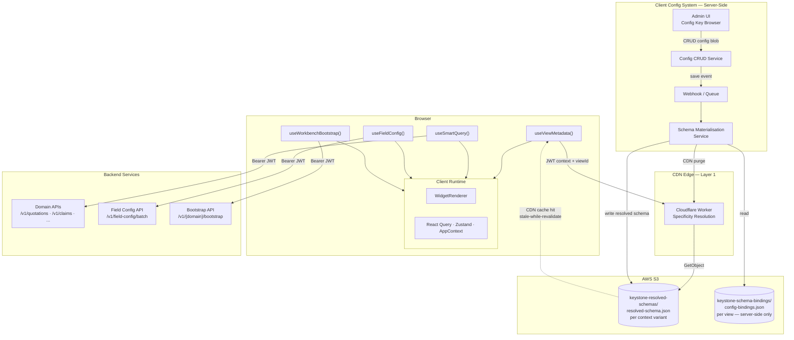

# Keystone UI — System Design

**Status:** Current  
**Date:** 2026-04-08  
**Audience:** Tech Leadership · Engineering  
**Detail docs:** [`docs/browser-arch/`](./browser-arch/)

---

## What This System Is

Keystone UI is a multi-tenant insurance platform. Every page is described as a **schema** — a JSON document that says what widgets appear on the page, what columns a table has, what actions are available, and what conditions control visibility. The browser fetches that schema, then independently fetches the data to fill it. Structure and data never travel together.

The architecture is browser-based. There is no middleware server assembling the UI before it reaches the browser. The browser talks directly to the backend, schemas are resolved at the CDN edge, and display configuration — labels, translations, badge colours — is pre-computed server-side so the browser only ever receives ready-to-render output.

---

## The Full System



---

## How This Works — Walking Through the Diagram

Let's trace what happens when a user opens the quotations list page. This walkthrough covers every component and every arrow in the diagram above.

---

### Step 1 — The browser needs to know what the page looks like

The browser doesn't have the page structure locally. It calls `useViewMetadata()`, which sends a request to the **CDN edge function** — a lightweight Cloudflare Worker running at the network edge, close to the user.

The request includes the user's JWT token. The Worker reads three things from it: `tenantId`, `role`, `lob`, `locale`, and `portalType`. It uses these to figure out which version of the schema to serve.

Here's why that matters: the quotations list looks different depending on who's looking at it. An underwriter at Tenant A needs different columns, different actions, and possibly different labels than a broker at Tenant B. We handle this by pre-building one schema file per meaningful context combination and storing them in S3:

```
keystone-resolved-schemas/quotations-list/
  base.json                                    ← default, for anyone not matched below
  tenant=gi.json                               ← GI tenant override
  tenant=gi+role=underwriter.json              ← GI underwriters specifically
  tenant=gi+role=underwriter+lob=motor.json    ← GI motor underwriters
  ...
```

The Worker loads the list of available files for this view, scores each one against the user's context, and picks the best match — the file with the most matching dimensions wins. This is the same idea as CSS specificity: the most specific rule wins. The Worker then fetches that file from S3 and returns it to the browser with a long cache header (`Cache-Control: public, max-age=300, stale-while-revalidate=3600`), so subsequent requests hit the CDN without touching S3 at all.

**What's inside that file?** The schema tells the browser the page structure: which widgets to render, in what layout, with what columns and actions. Crucially, it also already contains all the display values — labels like "Pending Approval" for a status badge, the page title, any translated strings. The browser doesn't look these up. They're already there, baked in. We'll come back to how they got there.

Once the schema is in the browser, React Query caches it for 5 minutes. If the user navigates away and comes back, the cached schema is used immediately — no network call.

---

### Step 2 — Each widget fetches its own data

The schema the browser just received describes each widget's data source: "call `/v1/quotations` with these params to get the rows." The widgets — through `useSmartQuery()` — make those calls directly to the **backend APIs** with the user's JWT as a Bearer token.

The backend validates the token (the platform middleware team built this — tenant guard, role check, permissions), executes the query, and returns domain data: rows, metrics, entities.

Two things to notice here:

**Schema and data are completely independent.** The schema is structural and stable — it changes rarely and is cached for minutes. The data is volatile — it changes constantly and is never cached for long. If a data fetch fails or is slow, the page still loads and shows its structure with an empty or loading state. The page doesn't disappear because a backend was slow.

**The browser talks directly to the backend.** There is no server in the middle translating requests. The backend URLs are known to the browser. This is intentional — the security boundary is the JWT, not network topology. The backend validates every request. Hiding URLs behind a proxy doesn't make the system more secure; validating tokens does.

---

### Step 3 — Forms fetch their field rules

This step only happens on pages with forms. When a form mounts, `useFieldConfig()` calls the **Field Config API** with a list of field IDs. The API responds with a set of rules — one per field — in JSONLogic format:

```json
{
  "dependentDOB": {
    "visibility": { "===": [{ "var": "formValues.hasDependents" }, true] }
  },
  "medicalHistory": {
    "required": { "===": [{ "var": "$context.lob" }, "health"] }
  }
}
```

These rules are fetched once per form and cached for 5 minutes. From that point, the browser evaluates them **locally** every time the user types — no server round-trip per keystroke. The rule above says "show `dependentDOB` if `hasDependents` is true in the form." The browser evaluates that against current form state and shows or hides the field instantly.

Notice the second rule references `$context.lob`. That's the user's line of business from their JWT — not from the form. A user cannot fake their `$context` by typing something into a field. The rules can express business logic that depends on who the user is, not just what they've typed.

**What field rules are not for:** they don't control whether a user *can* approve a quote or issue a policy. That's action capability, which lives in the workflow contract (Step 4).

---

### Step 4 — Workbench pages get one coherent snapshot

Dashboards and queue screens are simple: one schema fetch, each widget fetches its own data. Fine.

Complex workbench pages are different — a quotation cockpit, a claims desk, a policy servicing screen. These have 8–10 panels that must all represent the *same moment in time*. If each panel fetches data independently, you get inconsistent states: the case header says "Pending" while the action panel says "Approved," because a mutation landed between two fetches. Debugging that is a nightmare.

So workbench pages use `useWorkbenchBootstrap()`, which makes **one call** to the Bootstrap API and receives everything the page needs for its first render:

```
GET /v1/quotations/bootstrap?entityId=QT-2024-0042

Response:
  caseHeader       — the quote header for the page title
  entities         — risk entities, plan summaries
  workflow         — stage, allowed actions, blockers
  jobs             — any running async jobs
  regionPayloads   — data pre-loaded for each major panel
```

Every panel hydrates from this one snapshot. After the initial render, individual panels can refresh their own data independently — but the first render is always coherent.

The `workflow` part of this response is particularly important. It's the backend's evaluation of the current state of this case:

```json
{
  "workflow": {
    "stage": "UNDERWRITING_REVIEW",
    "actions": {
      "approveQuote":    { "enabled": false, "reasons": ["pricing_not_finalized"] },
      "requestEvidence": { "enabled": true }
    },
    "blockers": []
  }
}
```

The "Approve Quote" button reads `workflow.actions.approveQuote.enabled`. It's `false`, so it renders as disabled with the reason "pricing not finalised." This decision came from the backend — it evaluated the current state of the quote and told the UI what's allowed. The UI reflects it; the backend enforces it. If someone somehow triggered the approve endpoint anyway, the backend would reject it. The UI is a reflection, not the gate.

---

### Step 5 — How the labels got into the schema

Go back to Step 1. The schema file already had "Pending Approval" in it. The Worker didn't fetch that from anywhere. The browser didn't look it up. How did it get there?

This is the **Client Config System**. It's a server-side system that owns all display semantics — labels, translations, badge colours. The backend owns domain codes like `PENDING_APPROVAL`. The Config System owns what those codes mean to users.

Here's the flow, starting from the bottom-left of the diagram:

An admin opens the **Admin UI** and changes a label — say, "Pending Approval" becomes "Under Review." They save it. The **Config CRUD Service** writes the new value and emits a save event onto a **queue** (or webhook).

The **Schema Materialisation Service** picks up the event. It knows which config key changed. It scans all schema binding files — stored in the private `keystone-schema-bindings` S3 bucket — to find every view that uses this config key. For each one, it resolves all the config bindings for every context variant of that schema, producing updated `resolved-schema.json` files. It writes those to the `keystone-resolved-schemas` S3 bucket and fires a CDN cache purge for the affected paths.

The next user who loads the quotations list page gets the Worker, which fetches the freshly written file from S3, and serves "Under Review" to the browser. No frontend deployment. No code change. The schema file changed, and that's all.

**Why this matters:** labels and translations are not in the codebase. They're in the Config System. A product manager can rename a status, add a translation, or change a badge colour through the admin UI — without involving an engineer. The change propagates automatically to every tenant and context that uses that config key.

There are two S3 buckets in play with deliberately different access controls:
- `keystone-resolved-schemas` — the Cloudflare Worker can read it; the CDN caches from it; the browser ultimately sees what's in it
- `keystone-schema-bindings` — private; only the Materialisation Service can read it; no browser, no CDN, no Worker ever touches it

---

### The Full Picture

To summarise what happens when a user loads a page:

1. `useViewMetadata()` → CDN Worker → S3 → **the right schema for this user, with labels already resolved**
2. Each widget's `useSmartQuery()` → Backend API → **live domain data**
3. If there's a form: `useFieldConfig()` → Field Config API → **field rules, evaluated locally per keystroke**
4. If it's a workbench: `useWorkbenchBootstrap()` → Bootstrap API → **one coherent snapshot including workflow state and action capabilities**

And separately, whenever an admin changes a label:
- Config System → queue event → Materialisation Service → rewrite schemas in S3 → purge CDN cache → **next schema fetch gets the new value**

There is no server assembling this. Each of the four browser flows is independent, separately cacheable, and separately deployable. A schema change doesn't require a code deploy. A label change doesn't require a schema change. A data model change in the backend is caught by contract tests before it reaches production.

---

## Design Principles

These are the decisions that give the architecture its shape. Every non-obvious choice above traces back to one of these.

**Schema is the business entity. Components are UI.** The schema says what a page contains and how it behaves. Components render what they receive. A `Badge` component doesn't know if it's rendering a quotation status or a claims status — it just renders `{ label, variant }`. The schema is the thing that carries business context.

**Display semantics belong to the Config System, not the backend.** The backend produces `PENDING_APPROVAL`. The Config System produces `{ label: "Pending Approval", variant: "warning" }`. The backend never dictates what things look like. The Config System never dictates business logic. This boundary is what allows labels to change without code changes.

**Config is pre-materialised, not transformed in the browser.** Transformation runs server-side at config save time. The browser fetches resolved output. No logic executes in the browser to produce labels from raw values — that would mean sending transformation code to every user's browser, which is both a security risk and a performance cost.

**Action capabilities come from the backend.** `canApprove`, `canIssue`, `canPost` — these are not derived from browser state or config. They come from backend evaluation in the workflow contract. The UI reflects them; the backend enforces them.

**Contract violations are caught before users are affected.** Backend API changes are validated against consumer contract tests (Pact) in CI, before deployment. Every API response is also parsed against a Zod schema in the browser at runtime as a safety net. Any violation fires an alert immediately.

**Schema context dimensions are stable.** Schema variants are resolved by `tenantId`, `role`, `lob`, `locale`, `portalType` — slow-changing identity dimensions. Transactional state (quote stage, claim severity) never drives schema variants. It drives workflow contracts. Mixing the two would create an explosion of schema combinations that can't be managed.

---

## Going Deeper

The sections below are reference material. Read them when you're working in that layer.

### Layer 1 — Edge Schema Resolution
The specificity algorithm, full S3 key naming spec, Worker script, cache and pre-warming strategy.  
→ [`01-EDGE-SCHEMA-RESOLUTION.md`](./browser-arch/01-EDGE-SCHEMA-RESOLUTION.md) · [`01a`](./browser-arch/01a-CLOUDFLARE-WORKER.md) · [`01b`](./browser-arch/01b-S3-SCHEMA-LAYOUT.md) · [`01c`](./browser-arch/01c-SPECIFICITY-ALGORITHM.md)

### Layer 2 — Auth and Security
JWT lifecycle in the browser, the claims contract, CORS, 404-not-403 for IDOR prevention.  
→ [`02-AUTH-AND-SECURITY.md`](./browser-arch/02-AUTH-AND-SECURITY.md) · [`02a`](./browser-arch/02a-JWT-CLAIMS-CONTRACT.md) · [`02b`](./browser-arch/02b-BACKEND-JWT-VALIDATION.md) · [`02c`](./browser-arch/02c-IDOR-AND-CORS.md)

### Layer 3 — Client Config System
Config blob data model, schema binding declarations, the materialisation algorithm, key governance and deprecation.  
→ [`03-CLIENT-CONFIG-SYSTEM.md`](./browser-arch/03-CLIENT-CONFIG-SYSTEM.md) · [`03a`](./browser-arch/03a-CONFIG-BLOB-SCHEMA.md) · [`03b`](./browser-arch/03b-SCHEMA-BINDINGS.md) · [`03c`](./browser-arch/03c-MATERIALISATION-SERVICE.md) · [`03d`](./browser-arch/03d-KEY-GOVERNANCE.md)

### Layer 4 — Contract Enforcement
Pact consumer tests, `createApiClient` factory, Browser Zod, Sentry and Datadog integration, PagerDuty alerting.  
→ [`04-CONTRACT-ENFORCEMENT.md`](./browser-arch/04-CONTRACT-ENFORCEMENT.md) · [`04a`](./browser-arch/04a-PACT-CONTRACT-TESTING.md) · [`04b`](./browser-arch/04b-BROWSER-ZOD-AND-OBSERVABILITY.md)

### Layer 5 — Field Config API
API specification, JSONLogic patterns and anti-patterns, `$context` security model, local evaluation.  
→ [`05-FIELD-CONFIG-API.md`](./browser-arch/05-FIELD-CONFIG-API.md) · [`05a`](./browser-arch/05a-API-SPECIFICATION.md) · [`05b`](./browser-arch/05b-JSONLOGIC-PATTERNS.md)

### Layer 6 — Client Runtime
State stores, rendering pipeline, condition system, workbench bootstrap, workflow and draft runtimes, widget registry.  
→ [`06-CLIENT-RUNTIME.md`](./browser-arch/06-CLIENT-RUNTIME.md) · [`06a`](./browser-arch/06a-STATE-MANAGEMENT.md) · [`06b`](./browser-arch/06b-WIDGET-AND-FIELD-CONDITIONS.md) · [`06c`](./browser-arch/06c-WORKBENCH-RUNTIME.md) · [`06d`](./browser-arch/06d-WIDGET-REGISTRY.md)
