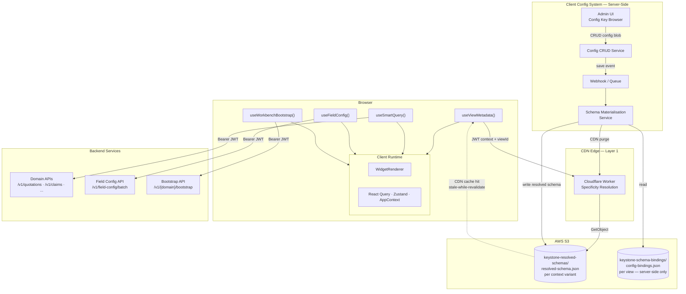
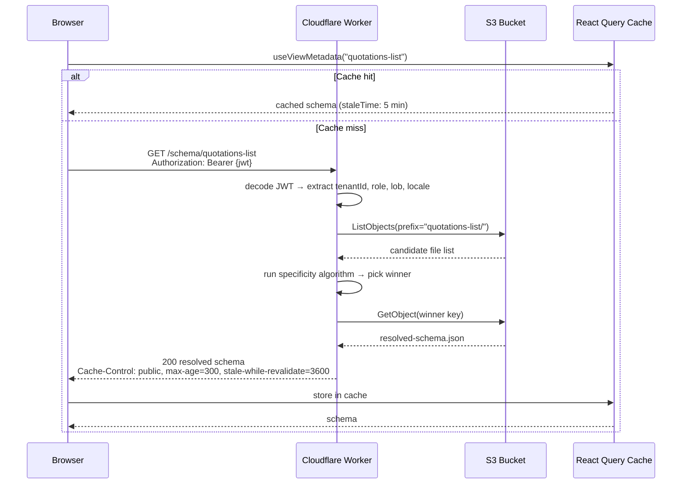
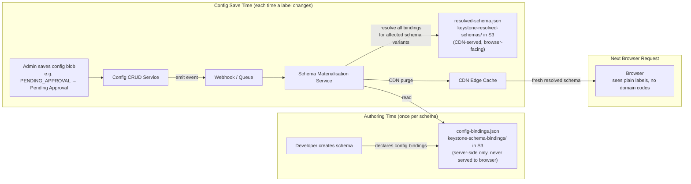
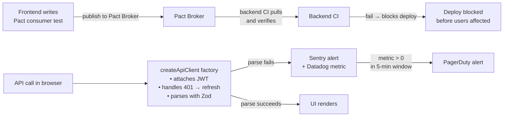
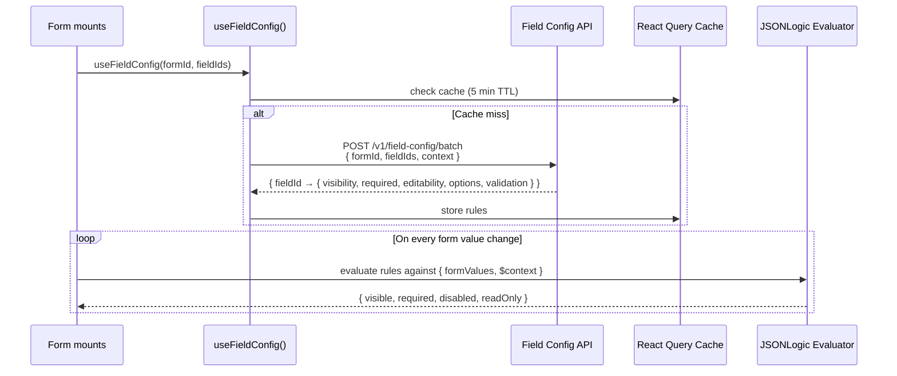
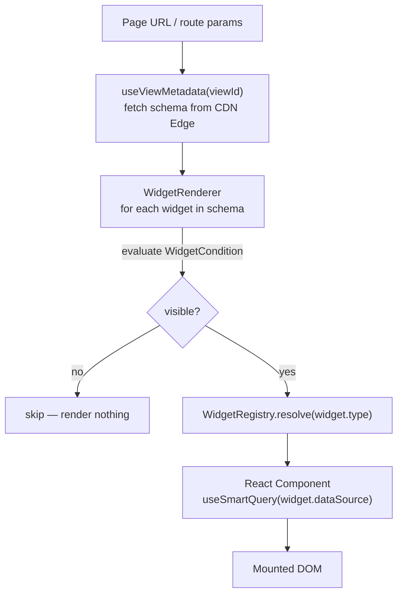
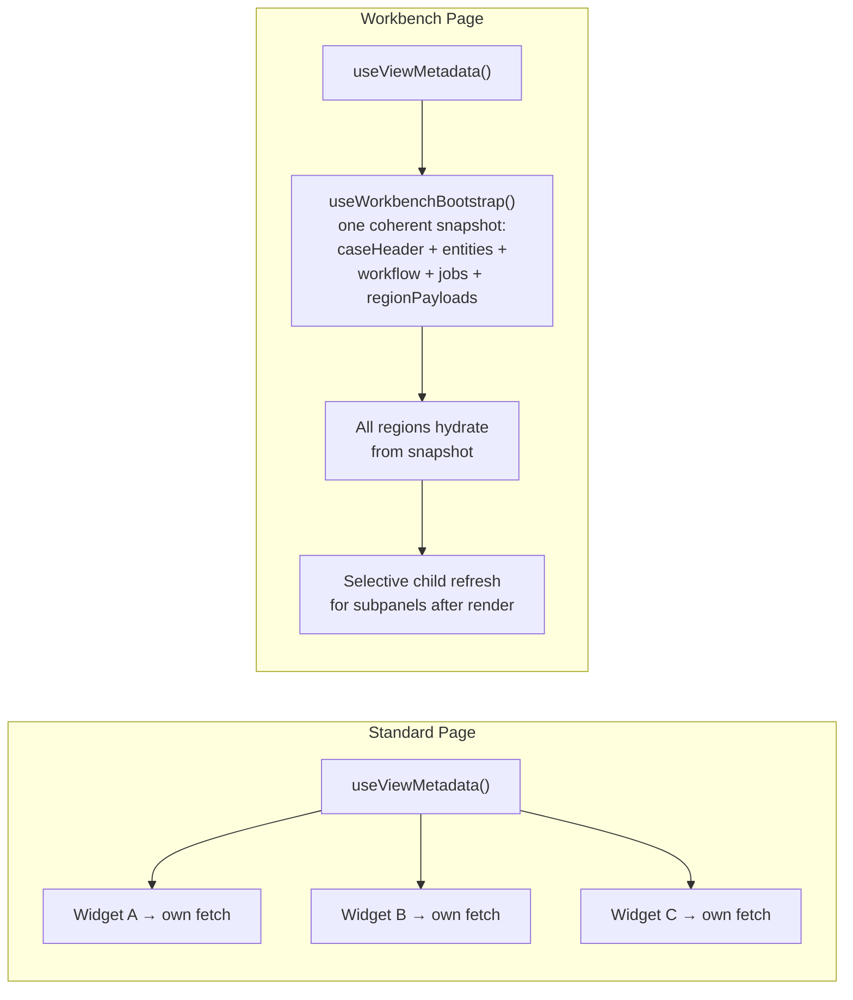

# Keystone UI — System Design

**Status:** Current  
**Date:** 2026-04-08  
**Audience:** Tech Leadership · Engineering  
**Detail docs:** [`docs/browser-arch/`](./browser-arch/)

---

## Executive Summary

Keystone UI is a metadata-driven, multi-tenant insurance platform. Every screen is described as a schema — a JSON document defining layout, widgets, columns, actions, and conditions. The browser fetches the schema for the current page, then independently fetches the data to populate it. Structure and data are always separate.

The assembly architecture is browser-based. There is no middleware server between the browser and the backend. Schemas are resolved at the CDN edge, data is fetched directly from backend APIs with JWT authentication, and display configuration (labels, translations, badge variants) is materialised server-side before it ever reaches the browser. Three independent data flows replace what a backend-for-frontend server would otherwise own — each independently cacheable, deployable, and scalable.

The result: no server to provision, monitor, or scale for UI assembly. Schema resolution runs at the network edge. Display config updates without a frontend deployment. Field-level conditional logic runs entirely in the browser with no round-trips per keystroke. And contract violations between the frontend and backend are caught in CI before they reach production users.

---

## Full System Architecture



**Three browser-initiated flows:**

| Flow | Hook | Destination | What it returns |
|---|---|---|---|
| Schema | `useViewMetadata()` | CDN Edge → S3 | Resolved schema (layout + pre-materialised config values) |
| Data | `useSmartQuery()` / `useWorkbenchBootstrap()` | Backend APIs | Domain data, workflow contract |
| Field rules | `useFieldConfig()` | Field Config API | JSONLogic rules, evaluated locally |

**One server-side flow (not browser-initiated):**

Admin saves a config blob → Config System emits an event → Schema Materialisation Service rewrites the affected resolved schemas in S3 → CDN cache is purged. The browser's next schema fetch sees the new labels. No frontend deployment required.

---

## Layer 1 — Edge Schema Resolution

The CDN edge function is a stateless Cloudflare Worker co-deployed with the frontend. It has no persistent state, no database, and no application server.



**Specificity resolution:** Schema files in S3 are named with context dimensions — `tenant=gi+role=underwriter+lob=motor.json`. The worker scores each candidate file against the user's context (each matched dimension adds weight) and serves the highest-scoring file. More-specific fields override less-specific ones in a deep merge. This is the same mechanism CSS uses for selector specificity.

**What the schema contains:** The resolved schema has display values already baked in. There are no raw domain codes, no `{field}Display` conventions, no labels to translate. The Config System materialised them before the file was written to S3 (see Layer 3).

→ Detail: [`01-EDGE-SCHEMA-RESOLUTION.md`](./browser-arch/01-EDGE-SCHEMA-RESOLUTION.md) · [`01a`](./browser-arch/01a-CLOUDFLARE-WORKER.md) · [`01b`](./browser-arch/01b-S3-SCHEMA-LAYOUT.md) · [`01c`](./browser-arch/01c-SPECIFICITY-ALGORITHM.md)

---

## Layer 2 — Auth and Security

Auth is fully implemented by the backend platform team. The browser's responsibilities are narrow: hold the access token in memory, attach it to every request, and handle token expiry gracefully.

| Concern | Implementation |
|---|---|
| Access token storage | In-memory only (never `localStorage`). XSS cannot steal it. |
| Refresh token storage | `HttpOnly` cookie. JavaScript cannot read it. |
| Silent re-authentication | Refresh endpoint called automatically before access token expires |
| Request auth | `Authorization: Bearer {token}` attached by `createApiClient` factory |
| 401 handling | `createApiClient` attempts one silent refresh, then retries. On second 401, redirect to login. |
| Cross-tenant access | Backend returns `404` not `403` — prevents resource existence leakage |
| CORS | Configured by backend platform middleware. Frontend origin is whitelisted across all services. |
| Action capabilities | Evaluated by the orchestration backend, returned in the workflow contract. Never derived from browser config or cached state. |

The JWT carries: `userId`, `tenantId`, `role`, `lob`, `locale`, `portalType`, `permissions[]`. These populate `AppContext` on login and are immutable for the session. The edge function reads these claims to resolve the schema variant; it does not re-validate the signature (that is the backend's job).

→ Detail: [`02-AUTH-AND-SECURITY.md`](./browser-arch/02-AUTH-AND-SECURITY.md) · [`02a`](./browser-arch/02a-JWT-CLAIMS-CONTRACT.md) · [`02b`](./browser-arch/02b-BACKEND-JWT-VALIDATION.md) · [`02c`](./browser-arch/02c-IDOR-AND-CORS.md)

---

## Layer 3 — Client Config System

This is the most architecturally significant layer. It establishes a single source of truth for all display semantics: labels, translations, badge colours, and display flags. The backend owns domain codes (`PENDING_APPROVAL`). The Config System owns what those codes mean to the user.



**Schema-level binding declaration:** Config bindings are declared on the schema, not on the component. A `Badge` component is context-free — it receives `{ label, variant }` as plain props. The schema for `quotations-list` declares that `columns.status.valueMap` should be resolved from config key `insurance.quotation.status`. The component never knows which config key it came from.

**Pre-materialisation:** Transformations run server-side at config save time. The browser fetches the already-resolved output. No transformation logic ever executes in the browser.

**Fallback:** If the backend introduces a new enum value before its config mapping is registered, the Materialisation Service writes `{ label: "<raw_value>", variant: "neutral" }` and fires a `config.gap.detected` monitoring alert. No component breaks. The gap is visible in production monitoring before users notice it.

**Config key governance:** Keys are permanent identifiers — values can change, keys cannot be renamed. Adding a new key requires registering it in the owned namespace. Renames are two-step: add new key, migrate all bindings, deprecate old key.

→ Detail: [`03-CLIENT-CONFIG-SYSTEM.md`](./browser-arch/03-CLIENT-CONFIG-SYSTEM.md) · [`03a`](./browser-arch/03a-CONFIG-BLOB-SCHEMA.md) · [`03b`](./browser-arch/03b-SCHEMA-BINDINGS.md) · [`03c`](./browser-arch/03c-MATERIALISATION-SERVICE.md) · [`03d`](./browser-arch/03d-KEY-GOVERNANCE.md)

---

## Layer 4 — Contract Enforcement

A backend field rename should never silently break the UI for production users. Two complementary layers prevent this.



**Pact (CI — pre-deployment):** The frontend team writes consumer contract tests that describe the exact shape expected from each API. The backend CI downloads and verifies these contracts. A field rename (`amountCents` → `amount_cents`) fails the backend's Pact verification step and blocks the deployment. No user is affected because the change never reaches production.

**Browser Zod (runtime — safety net):** Every API call in the browser goes through `createApiClient`. This factory attaches the JWT, handles 401 → silent refresh → retry, and parses the response against a Zod schema. If parsing fails, a `ZodContractViolationError` is reported to Sentry with full context and a Datadog metric is incremented. A PagerDuty alert fires on any production occurrence. No raw `fetch()` calls are permitted — a `no-raw-fetch` ESLint rule enforces this.

The resolved schema returned by the CDN edge also has a Zod schema (`WidgetConfigSchema`). It goes through `createApiClient` like any other API call.

→ Detail: [`04-CONTRACT-ENFORCEMENT.md`](./browser-arch/04-CONTRACT-ENFORCEMENT.md) · [`04a`](./browser-arch/04a-PACT-CONTRACT-TESTING.md) · [`04b`](./browser-arch/04b-BROWSER-ZOD-AND-OBSERVABILITY.md)

---

## Layer 5 — Field Config API

Field-level conditional logic — which fields are visible, which are required, which are editable — is owned by the backend. It is served as JSONLogic expressions and evaluated entirely in the browser with no server round-trips per keystroke.



`$context` in rules contains `{ role, tenantId, lob, locale }` — populated from the JWT. A user cannot influence `$context` through form input. This is how rules like "this field is required only for `lob=health`" remain server-controlled even though evaluation is client-side.

**What Field Config is not:** It does not control action capabilities (`canApprove`, `canIssue`). Those come from the workflow contract, evaluated server-side. Field Config governs field-level UX within a form; workflow contracts govern business-critical action gating.

→ Detail: [`05-FIELD-CONFIG-API.md`](./browser-arch/05-FIELD-CONFIG-API.md) · [`05a`](./browser-arch/05a-API-SPECIFICATION.md) · [`05b`](./browser-arch/05b-JSONLOGIC-PATTERNS.md)

---

## Layer 6 — Client Runtime

The client runtime assembles schema, data, conditions, and components into a rendered page.

### State

Three stores, each with a specific scope:

| Store | Library | Holds | Lifetime |
|---|---|---|---|
| Server state | React Query | API responses, mutations | `staleTime: 5 min`, `gcTime: 10 min` |
| Interaction state | Zustand | Selected rows, open panels, filters | Page lifetime |
| Identity | AppContext | `userId`, `role`, `tenantId`, `lob`, `locale` | Login session (immutable) |

### Rendering Pipeline



`WidgetRenderer` is the only place where conditions gate rendering. Components receive props and render unconditionally — they contain no condition logic, making them independently testable.

### Standard vs Workbench Pages

**Standard pages** (dashboards, queues, list-detail): fetch schema once, each widget fetches its own data independently.

**Workbench pages** (quotation cockpit, PAS servicing, claims desk, accounting recon): require a single coherent snapshot on load to ensure all regions represent the same moment in time.



The bootstrap response includes the **workflow contract** — the backend's evaluation of what stage the case is in, which actions are currently allowed, and what blockers exist:

```json
{
  "workflow": {
    "stage": "UNDERWRITING_REVIEW",
    "actions": {
      "approveQuote":    { "enabled": false, "reasons": ["pricing_not_finalized"] },
      "requestEvidence": { "enabled": true }
    },
    "blockers": [],
    "draftState": { "exists": false }
  }
}
```

Action buttons in the UI read `workflow.actions` to determine their enabled state. The backend enforces the gate on the mutation endpoint regardless of what the UI shows.

### Widget Registry

The `WidgetRegistry` maps schema `type` strings to React components. Any component that satisfies a declared prop contract can be registered. The registry is type-agnostic — it does not classify components. Schema is the business entity; components are UI.

`WidgetRenderer` calls `WidgetRegistry.resolve(type, contractVersion)`. If the type is not registered, it renders a contained error boundary, not a page crash.

→ Detail: [`06-CLIENT-RUNTIME.md`](./browser-arch/06-CLIENT-RUNTIME.md) · [`06a`](./browser-arch/06a-STATE-MANAGEMENT.md) · [`06b`](./browser-arch/06b-WIDGET-AND-FIELD-CONDITIONS.md) · [`06c`](./browser-arch/06c-WORKBENCH-RUNTIME.md) · [`06d`](./browser-arch/06d-WIDGET-REGISTRY.md)

---

## Key Design Principles

**1. Schema is the business entity. Components are UI.**  
The schema describes what a page contains and how it behaves. Components render what they receive. A component has no knowledge of which schema it is being used in or which config key drove its label. Separation is total.

**2. Config pre-materialised server-side.**  
No transformation logic executes in the browser. The browser fetches resolved output. Labels, translations, and badge variants are baked into the schema by the Materialisation Service before the file is written to S3.

**3. Schema-level config binding, not component-level.**  
The schema declares what config keys it needs. The same `Badge` component renders correctly in a quotation list and a claims list because each schema declares different config bindings independently.

**4. Backend owns domain codes. Config System owns display semantics.**  
`PENDING_APPROVAL` is a backend domain code. "Pending Approval" with a warning badge is a Config System blob. The backend never dictates labels. The Config System never dictates business logic.

**5. Action capabilities come from the backend, not from the browser.**  
`canApprove`, `canIssue`, `canPost` are returned in the workflow contract from server-side orchestration evaluation. They are not derived from cached widget state, not stored in config, and not computed in the browser.

**6. Contract violations are caught before users are affected.**  
Pact consumer tests catch backend drift in CI. Browser Zod is the runtime safety net. An alert fires on any production contract violation. The system is designed to fail loudly and early.

**7. The schema context dimensions are stable.**  
Schema variants are resolved by: `tenantId`, `role`, `lob`, `locale`, `portalType`. These are slow-changing identity dimensions. Volatile transactional state (quote stage, claim severity) must not drive schema variants — it drives workflow contracts and action capabilities.

---

## Document Reference

| Document | Purpose |
|---|---|
| [`ARCHITECTURE.md`](./ARCHITECTURE.md) | Root reference — layer map, design decisions, trade-offs |
| [`01-EDGE-SCHEMA-RESOLUTION.md`](./browser-arch/01-EDGE-SCHEMA-RESOLUTION.md) | Edge function overview, cache strategy, error handling |
| [`01a-CLOUDFLARE-WORKER.md`](./browser-arch/01a-CLOUDFLARE-WORKER.md) | Worker script, bindings, KV cache, pre-warming |
| [`01b-S3-SCHEMA-LAYOUT.md`](./browser-arch/01b-S3-SCHEMA-LAYOUT.md) | S3 key naming spec, full context combination table, versioning |
| [`01c-SPECIFICITY-ALGORITHM.md`](./browser-arch/01c-SPECIFICITY-ALGORITHM.md) | Scoring rules, TypeScript implementation, merge algorithm, test cases |
| [`02-AUTH-AND-SECURITY.md`](./browser-arch/02-AUTH-AND-SECURITY.md) | Browser auth contract, JWT lifecycle, CORS |
| [`02a-JWT-CLAIMS-CONTRACT.md`](./browser-arch/02a-JWT-CLAIMS-CONTRACT.md) | JWT claims interface, silent refresh flow |
| [`02b-BACKEND-JWT-VALIDATION.md`](./browser-arch/02b-BACKEND-JWT-VALIDATION.md) | Error shapes, 401 retry sequence |
| [`02c-IDOR-AND-CORS.md`](./browser-arch/02c-IDOR-AND-CORS.md) | 404 rationale, CORS, token storage rules |
| [`03-CLIENT-CONFIG-SYSTEM.md`](./browser-arch/03-CLIENT-CONFIG-SYSTEM.md) | Config System overview, event flow, admin UI |
| [`03a-CONFIG-BLOB-SCHEMA.md`](./browser-arch/03a-CONFIG-BLOB-SCHEMA.md) | Config blob data model, value types, CRUD API |
| [`03b-SCHEMA-BINDINGS.md`](./browser-arch/03b-SCHEMA-BINDINGS.md) | Binding declaration format, 3 mapping types, authoring workflow |
| [`03c-MATERIALISATION-SERVICE.md`](./browser-arch/03c-MATERIALISATION-SERVICE.md) | Materialisation algorithm, retry policy, idempotency, monitoring |
| [`03d-KEY-GOVERNANCE.md`](./browser-arch/03d-KEY-GOVERNANCE.md) | Key immutability, deprecation lifecycle, namespace ownership |
| [`04-CONTRACT-ENFORCEMENT.md`](./browser-arch/04-CONTRACT-ENFORCEMENT.md) | Two-layer defence overview, ESLint rule, alerting |
| [`04a-PACT-CONTRACT-TESTING.md`](./browser-arch/04a-PACT-CONTRACT-TESTING.md) | Pact consumer test examples, CI step order |
| [`04b-BROWSER-ZOD-AND-OBSERVABILITY.md`](./browser-arch/04b-BROWSER-ZOD-AND-OBSERVABILITY.md) | `createApiClient` factory, Zod schemas, Sentry/Datadog integration |
| [`05-FIELD-CONFIG-API.md`](./browser-arch/05-FIELD-CONFIG-API.md) | Field Config API overview, `useFieldConfig` hook |
| [`05a-API-SPECIFICATION.md`](./browser-arch/05a-API-SPECIFICATION.md) | Endpoint spec, TypeScript interfaces, Zod schema, example payload |
| [`05b-JSONLOGIC-PATTERNS.md`](./browser-arch/05b-JSONLOGIC-PATTERNS.md) | Common patterns, `$context`, anti-patterns, unit tests |
| [`06-CLIENT-RUNTIME.md`](./browser-arch/06-CLIENT-RUNTIME.md) | Runtime overview, state stores, rendering pipeline, hook inventory |
| [`06a-STATE-MANAGEMENT.md`](./browser-arch/06a-STATE-MANAGEMENT.md) | React Query config, Zustand store structure, AppContext |
| [`06b-WIDGET-AND-FIELD-CONDITIONS.md`](./browser-arch/06b-WIDGET-AND-FIELD-CONDITIONS.md) | WidgetCondition and RowCondition interfaces, 5 worked examples |
| [`06c-WORKBENCH-RUNTIME.md`](./browser-arch/06c-WORKBENCH-RUNTIME.md) | Bootstrap hook, WorkflowRuntime, DraftRuntime, JobRuntime, AuditRuntime |
| [`06d-WIDGET-REGISTRY.md`](./browser-arch/06d-WIDGET-REGISTRY.md) | Registry API, prop contract declaration, versioning, contract testing |
