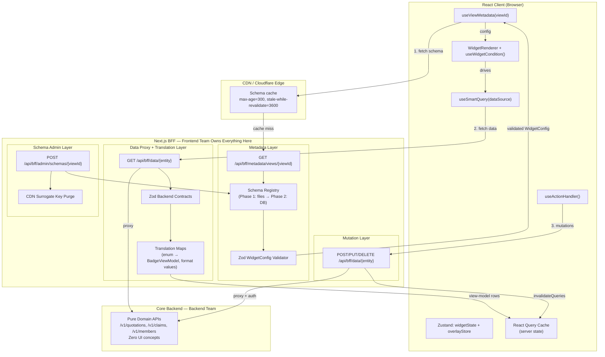
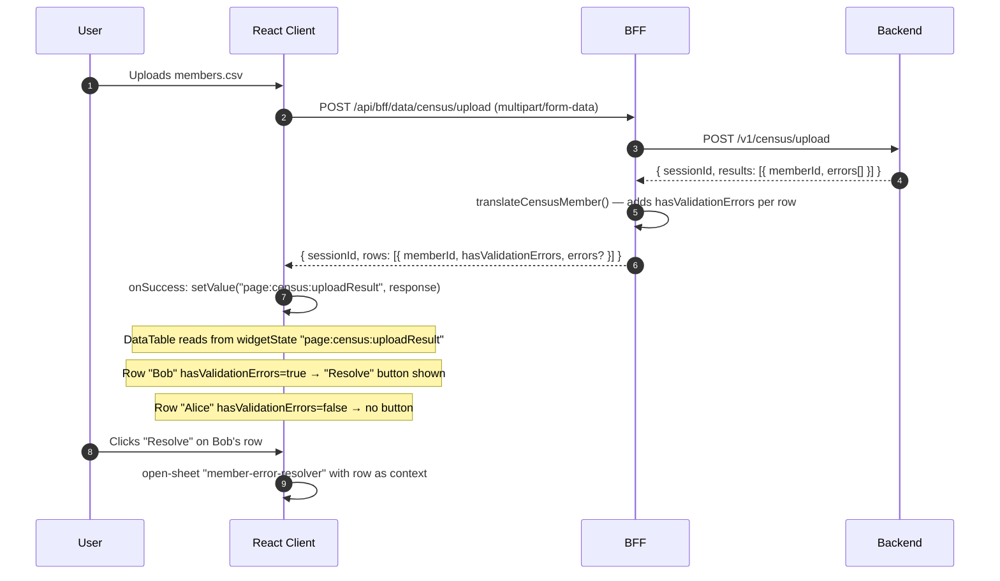

# Keystone UI: Metadata-Driven Architecture


## Table of Contents

1. [What We Are Solving](#1-what-we-are-solving)
2. [Architecture in One Diagram](#2-architecture-in-one-diagram)
3. [The Two-Call Rule](#3-the-two-call-rule)
4. [Rejected Approaches and Why](#4-rejected-approaches-and-why)
5. [Layer 1 — BFF Metadata Service](#5-layer-1--bff-metadata-service)
6. [Layer 2 — BFF Data Proxy and Translation](#6-layer-2--bff-data-proxy-and-translation) *(includes CMS-style mapping store)*
7. [Layer 3 — Client Integration](#7-layer-3--client-integration)
8. [The Unified Condition System](#8-the-unified-condition-system)
9. [Extensible Schema Resolution: Context Dimensions](#9-extensible-schema-resolution-context-dimensions)
10. [Response-Driven UI: The File Upload Pattern](#10-response-driven-ui-the-file-upload-pattern)
11. [Type System and Contracts](#11-type-system-and-contracts)
12. [State Management: Three Stores, One Rule](#12-state-management-three-stores-one-rule)
13. [Caching Strategy](#13-caching-strategy)
14. [Team Boundaries and Responsibilities](#14-team-boundaries-and-responsibilities)
15. [Migration Plan](#15-migration-plan)
16. [Known Pitfalls and Mitigations](#16-known-pitfalls-and-mitigations)
17. [Open Questions](#17-open-questions)

---

## 1. What We Are Solving

### Current state

Keystone UI is already schema-driven. Every page is a `WidgetConfig` tree stored in `/schemas/*.json`. `WidgetRenderer` reads the tree, resolves components through `WidgetRegistry`, and `useSmartQuery` fetches data per `dataSource` config. **Schema and data are already separated** — this is the correct foundation.

The problem is one thing: **schemas are bundled inside the frontend deploy artifact**. Any UI structural change — a new column, a reordered dashboard, an action visible only to one tenant — requires a frontend PR and a full deploy.

### What changes

Two things would change: **where the `WidgetConfig` tree comes from** and **Data fetches would be proxied by BFF**

| Layer | Before | After |
|-------|--------|-------|
| Schema origin | `import schema from '@/schemas/quotations.json'` | `GET /api/bff/metadata/views/{viewId}` |
| Data origin | `useSmartQuery` → `/api/*` | `useSmartQuery` → `/api/bff/data/*` |
| `WidgetRenderer` | Unchanged | Unchanged |
| `WidgetRegistry` | Unchanged | Unchanged |
| `useSmartQuery` | Unchanged | Unchanged |
| `useActionHandler` | Unchanged | Unchanged |
| All widget components | Unchanged | Unchanged |

The frontend becomes a **pure renderer**: it owns the component library and rendering engine, and nothing else. Layout, columns, actions, and conditions live in the BFF.

---

## 2. Architecture in One Diagram



---

## 3. The Two-Call Rule

Every page makes exactly two categories of network calls, independent of each other:

```
┌─────────────────────────────────────────────────────────────────┐
│ Call 1: Schema                                                  │
│ GET /api/bff/metadata/views/{viewId}                            │
│ Returns:  WidgetConfig tree — structure only, never data        │
│ Cache:    CDN edge, long TTL                                    │
│ Changes:  Hours to days (layout, columns, actions)             │
└─────────────────────────────────────────────────────────────────┘

┌─────────────────────────────────────────────────────────────────┐
│ Call 2: Data (one per widget with a dataSource)                 │
│ GET /api/bff/data/{entity}                                      │
│ Returns:  View-model rows, metrics, entity fields               │
│ Cache:    React Query, short TTL                                │
│ Changes:  Seconds to minutes (user actions, filter changes)    │
└─────────────────────────────────────────────────────────────────┘
```

**The invariant:** schema and data are never merged into one response. This is the core principle the entire architecture is built on.

- A data failure affects only the data widget. The page skeleton stays intact.
- A schema can be cached for hours independently of data that changes by the second.
- The schema shell renders immediately; data populates progressively.

---

## 4. Rejected Approaches and Why

### Approach 1: BFF merges schema + data (the original SDUI proposal)

```json
{ "components": [{ "type": "data-table", "props": {...}, "data": [...rows] }] }
```

**Rejected because:** It couples two things with incompatible change frequencies and caching requirements. Schema is stable (cache for hours). Data is volatile (cache for seconds). Merging them means a data failure poisons the schema response, a row change forces a schema re-fetch, streaming is impossible, and every page load must wait for all data before the first byte of structure can be served.

### Approach 2: Backend owns and serves schemas

**Rejected because:** The backend team doesn't know the schemas and shouldn't. `WidgetConfig`, column definitions, `ActionConfig`, and badge colors are UI vocabulary. Putting them in the backend DB introduces UI concerns into the domain layer, gives the backend team veto power over UI changes, and requires a backend deploy for a dashboard layout change. The backend's job is to serve pure domain data under a contract the BFF defines.

### Approach 3: Static bundled schemas (status quo)

**Retained as Phase 1 of the migration only.** Schemas are moved from the frontend bundle into the BFF codebase and served via an API. Schema changes still require a BFF deploy, but the client always fetches at runtime — enabling CDN control and per-tenant overrides as the next step. This is the zero-infrastructure starting point.

---

## 5. Layer 1 — BFF Metadata Service

The BFF (Next.js, owned by Frontend Team) is the authoritative source of all UI schemas. Nothing else stores or serves `WidgetConfig` trees.

### 5.1 Endpoint Specification

```
GET /api/bff/metadata/views/{viewId}

Auth:    Session cookie (role and tenantId resolved server-side — never trusted from params)
Headers:
  Cache-Control: public, max-age=300, s-maxage=300, stale-while-revalidate=3600
  Surrogate-Key: schema-{viewId}
  ETag: "{viewId}-v{version}"

Success: 200  WidgetConfig
Errors:
  400  INVALID_PARAMS   — missing required session context
  401  UNAUTHORIZED
  404  SCHEMA_NOT_FOUND — no schema for this viewId + context
  422  SCHEMA_INVALID   — stored schema failed Zod validation
  500  INTERNAL_ERROR
```

**Security rule:** `tenantId` and `role` are always read from the server-side session, never from query params. A client cannot request another tenant's schema by spoofing a param.

### 5.2 Schema Storage: Two Phases

#### Phase 1 — Files in BFF (immediate, zero infra)

Move `/schemas/*.json` into `src/bff/metadata/schemas/`. The metadata endpoint reads files at request time. Schema changes require a BFF deploy, but are no longer bundled with the client.

```
src/bff/metadata/schemas/
├── quotations-list/
│   ├── default.json
│   └── auto-claims.json          ← tenant override
├── dashboard/
│   ├── default.json
│   └── group-insurance.json      ← tenant override
└── ...
```

#### Stage 2 — BFF-owned DB (deploy-independent updates)

> **Note on naming:** This is "Stage 2" of schema storage evolution — not to be confused with "Phase 2" of the migration plan in §15. The migration plan phase that implements this stage is **Phase 6**.

Trigger: when the team needs to change a schema without a BFF deploy.

```sql
CREATE TABLE view_schemas (
  id          UUID PRIMARY KEY DEFAULT gen_random_uuid(),
  view_id     VARCHAR(255) NOT NULL,
  context     JSONB        NOT NULL DEFAULT '{}',  -- see §9 for context dimensions
  priority    INTEGER      NOT NULL DEFAULT 0,
  config      JSONB        NOT NULL,
  version     INTEGER      NOT NULL DEFAULT 1,
  is_active   BOOLEAN      NOT NULL DEFAULT true,
  created_at  TIMESTAMPTZ  NOT NULL DEFAULT NOW(),
  created_by  VARCHAR(255),
  change_note TEXT
);

-- One active schema per (view_id, context) combination
CREATE UNIQUE INDEX view_schemas_active_unique
  ON view_schemas (view_id, context)
  WHERE is_active = true;

CREATE INDEX view_schemas_gin ON view_schemas USING gin (context jsonb_path_ops);
```

### 5.3 Schema CRUD API

```
GET    /api/bff/admin/schemas                  — list all schemas
GET    /api/bff/admin/schemas/{viewId}         — current active schema
GET    /api/bff/admin/schemas/{viewId}/history — all versions (for rollback)
POST   /api/bff/admin/schemas/{viewId}         — create/update (validates → versions → CDN purge)
DELETE /api/bff/admin/schemas/{viewId}         — soft delete (is_active = false)
POST   /api/bff/admin/schemas/{viewId}/rollback  { version: N } — reactivate a prior version
```

Every write:
1. Validates the config against `WidgetConfigSchema` (Zod)
2. Inserts new version, deactivates previous
3. Purges CDN surrogate key `schema-{viewId}`

### 5.4 Schema Validation (Zod)

The `WidgetConfig` TypeScript type in `src/types/widget.ts` is the source of truth. The Zod schema mirrors it and is enforced at both write time and serve time. A bad schema never reaches the renderer.

```typescript
// src/bff/metadata/validator.ts
export const WidgetConfigSchema: z.ZodType<WidgetConfig> = z.lazy(() =>
  z.object({
    id: z.string().min(1),
    type: z.string().min(1),
    props: z.record(z.any()).optional(),
    layout: z.object({
      colSpan: z.number().int().min(1).max(12).optional(),
      hidden: z.boolean().optional(),
      condition: z.union([WidgetConditionSchema, z.array(WidgetConditionSchema)]).optional(),
    }).optional(),
    dataSource: DataSourceConfigSchema.optional(),
    children: z.array(WidgetConfigSchema).optional(),
  })
);
```

---

## 6. Layer 2 — BFF Data Proxy and Translation

### 6.1 Why Route Data Through the BFF

Four reasons, none of which are optional in this system:

1. **Translation must happen server-side.** The backend returns `"status": "PENDING"`. The widget needs `{ "label": "Pending", "color": "warning" }`. Translating in the browser means translation logic is in the bundle — updating a label requires a deploy. In the BFF, updating a translation map is a BFF deploy, not a client deploy.

2. **Backend auth tokens must not be in the browser.** The BFF authenticates to the Core Backend using a server-side service credential. The backend's URL and auth mechanism are never visible in browser DevTools.

3. **Param normalization.** The frontend sends `mainStatus=Approved`. The backend expects `status=APPROVED`. This mapping lives in the BFF.

4. **Contract enforcement.** Zod validation at the BFF boundary catches backend field renames immediately and returns a `502 CONTRACT_VIOLATION` — a server-side log — rather than silently corrupting data in every user's browser.

### 6.2 Endpoint Design

```
GET  /api/bff/data/{entity}              — list / query
GET  /api/bff/data/{entity}/{id}         — single entity
POST /api/bff/data/{entity}              — create
PUT  /api/bff/data/{entity}/{id}         — update
POST /api/bff/data/{entity}/{id}/{cmd}   — domain command (e.g. /withdraw, /approve)
```

All `dataSource.api.endpoint` values in schemas point to `/api/bff/data/*`. The Core Backend URL is never in a schema.

### 6.3 Translation Maps

#### Code-Owned Maps (Phase 1 — deploy to change)

Translation maps start as TypeScript constants version-controlled in the BFF. They are the source of truth for domain enum → display mapping.

```typescript
// src/bff/translation/quotation.maps.ts

export const MAIN_STATUS_MAP: Record<string, BadgeViewModel> = {
  'PENDING':     { label: 'Pending',     color: 'warning'     },
  'IN_PROGRESS': { label: 'In Progress', color: 'info'        },
  'APPROVED':    { label: 'Approved',    color: 'success'     },
  'REJECTED':    { label: 'Rejected',    color: 'destructive' },
  'WITHDRAWN':   { label: 'Withdrawn',   color: 'secondary'   },
};

// RULE: always provide a safe fallback. Never crash on an unknown enum value.
// Log a warning so the team knows a new value needs to be mapped.
export function lookupBadge(
  map: Record<string, BadgeViewModel>,
  value: string | null | undefined
): BadgeViewModel {
  if (!value) return { label: '—', color: 'default' };
  if (!map[value]) {
    console.warn(`[translation] Unknown enum value "${value}" — add to map`);
    return { label: value, color: 'default' };  // degrade gracefully
  }
  return map[value];
}
```

#### CMS-Style Mapping Store (Stage 2 — deploy-independent, WYSIWYG-capable)

> **Note on naming:** This is "Stage 2" of translation map evolution — implemented as an optional part of **Phase 6** of the migration plan in §15.

The same principle that moves schemas out of the bundle applies equally to translation maps. A label change (`"Pending"` → `"Under Review"`) is display configuration — it has no reason to require a BFF deploy. Storing maps in the DB enables:

- Label/color changes without any deployment
- Per-tenant, per-locale label variations using the same context dimension resolution as schemas (§9)
- A WYSIWYG admin surface where business users can edit display labels, preview the rendered badge, and save

**What can and cannot be stored as config:**

| Type | Example | CMS-storable? |
|------|---------|---------------|
| Simple value → display | `PENDING → { label, color }` | Yes |
| Multi-field derived | `status + expiryDate → urgency badge` | No — needs code |
| Computed/formatted | `amountCents / 100 → "₹1,234.56"` | No — needs code |

Simple field-to-display mappings (the large majority) are fully expressible as stored config. Complex derivations stay in BFF code.

**DB model:**

```sql
CREATE TABLE translation_maps (
  id          UUID PRIMARY KEY DEFAULT gen_random_uuid(),
  domain      VARCHAR(255) NOT NULL,   -- e.g. "quotation", "claim"
  field       VARCHAR(255) NOT NULL,   -- e.g. "mainStatus", "riskLevel"
  value       VARCHAR(255) NOT NULL,   -- e.g. "PENDING_APPROVAL"
  context     JSONB        NOT NULL DEFAULT '{}',  -- same dimension model as view_schemas
  label       VARCHAR(255) NOT NULL,
  color       VARCHAR(50)  NOT NULL,   -- constrained to allowed variants
  version     INTEGER      NOT NULL DEFAULT 1,
  is_active   BOOLEAN      NOT NULL DEFAULT true,
  created_at  TIMESTAMPTZ  NOT NULL DEFAULT NOW(),
  created_by  VARCHAR(255)
);

CREATE INDEX translation_maps_gin ON translation_maps USING gin (context jsonb_path_ops);
```

**Resolution:** same CSS-specificity model as schemas. A mapping with `context = { tenantId: "gi", locale: "hi" }` beats one with `context = { tenantId: "gi" }`, which beats the global fallback `context = {}`.

**BFF mapping runtime** (the translation layer doesn't disappear — it becomes an interpreter):

```typescript
// src/bff/translation/mappingRuntime.ts
export async function lookupBadgeFromStore(
  domain: string,
  field: string,
  value: string,
  context: Record<string, string>
): Promise<BadgeViewModel> {
  const row = await db.query(`
    SELECT label, color,
           (SELECT count(*)::int FROM jsonb_each_text(tm.context)) AS specificity
    FROM translation_maps tm
    WHERE domain = $1 AND field = $2 AND value = $3
      AND $4::jsonb @> context
      AND is_active = true
    ORDER BY specificity DESC LIMIT 1
  `, [domain, field, value, JSON.stringify(context)]);

  if (!row) {
    console.warn(`[translation] No mapping for ${domain}.${field}="${value}"`);
    return { label: value, color: 'default' };  // always degrade gracefully
  }
  return { label: row.label, color: row.color as BadgeColor };
}
```

**Type safety boundary:** When maps are in code, TypeScript catches invalid `color` values at compile time. When stored in the DB, validation must happen at write time (constrained `color` column + Zod validation on the admin API) and gracefully at read time.

**Caching:** Map lookups are stable (same as schemas). Cache the resolved `BadgeViewModel` per `(domain, field, value, context)` with the same CDN surrogate key strategy as schemas. Purge on map writes.

**Separation from schemas:** Maps and schemas version and invalidate independently. A label change must not increment the schema version. Store them in separate tables with separate admin endpoints:

```
GET  /api/bff/admin/mappings/{domain}/{field}              — list all values for a field
POST /api/bff/admin/mappings/{domain}/{field}/{value}       — create/update a mapping entry
GET  /api/bff/admin/mappings/{domain}/{field}/preview?value=PENDING  — render a live badge preview
```

**Phase trigger:** Move to CMS-style mapping store when a label change is blocked waiting for a BFF deploy, or when a product/ops team needs to manage display labels without engineering involvement.

### 6.4 Zod Backend Contracts

The BFF defines and owns the data shape it requires from the Core Backend. This is shared with the Backend Team as the agreed contract.

```typescript
// src/bff/contracts/quotation.contract.ts
// This is the document shared with the Backend Team.
// If the backend renames a field, this Zod parse fails with a clear error.
export const QuotationListResponseSchema = z.object({
  total: z.number().int().nonnegative(),
  results: z.array(z.object({
    id: z.string(),
    status: z.string(),          // enum validated in translation map, not here
    amountCents: z.number().int().nonnegative(),
    clientName: z.string(),
    effectiveDate: z.string().datetime(),
    membersCount: z.number().int().nonnegative(),
  }))
});
```

If the contract validation fails, the BFF returns `502 CONTRACT_VIOLATION`. The frontend never receives corrupt data.

### 6.5 URL Parameter Interpolation

Row action endpoints contain `:param` placeholders: `/api/bff/data/quotations/:id/withdraw`. `DataTable` substitutes `:id` with the row's `id` field at render time before passing the action to `useActionHandler`. This is a **convention** — schema authors must use `:fieldName` exactly as documented.

The BFF mutation route must validate authorization before proxying. Never trust the ID from the URL alone — a user could manipulate it to act on a record they don't own (IDOR risk):

```typescript
// ALWAYS validate ownership in mutation endpoints
const hasAccess = await verifyOwnership(params.id, session.userId, session.tenantId);
if (!hasAccess) return NextResponse.json({ error: 'FORBIDDEN' }, { status: 403 });
```

---

## 7. Layer 3 — Client Integration

### 7.1 `useViewMetadata` Hook

Replaces the static `import schema from '@/schemas/...'` in every page component.

```typescript
// src/hooks/useViewMetadata.ts
export function useViewMetadata(viewId: string) {
  const { appId } = useAppContext(); // used only as React Query cache discriminator

  return useQuery<WidgetConfig, Error>({
    queryKey: ['metadata', viewId, appId],  // appId scopes the browser cache per tenant
    queryFn: async () => {
      // tenantId and role are resolved server-side from the session cookie.
      // They are NEVER sent as query params — doing so would allow spoofing (see §5.1).
      const res = await fetch(`/api/bff/metadata/views/${viewId}`);
      if (!res.ok) throw new Error(`Schema load failed: ${res.status}`);
      return res.json();
    },
    staleTime: 5 * 60 * 1000,   // 5 min — schema is stable
    gcTime:   30 * 60 * 1000,   // keep in cache 30 min after last use
    retry: 2,
    retryDelay: attempt => Math.min(1000 * 2 ** attempt, 5000),
  });
}
```

### 7.2 Page Component Pattern

```tsx
// src/app/quotations/page.tsx
export default function QuotationsPage() {
  const { data: config, isLoading, error } = useViewMetadata('quotations-list');

  if (isLoading) return <PageSkeleton />;
  if (error)     return <SchemaErrorState error={error} viewId="quotations-list" />;

  return (
    <SchemaErrorBoundary viewId="quotations-list">
      <WidgetRenderer config={config!} />
    </SchemaErrorBoundary>
  );
}
```

### 7.3 `WidgetRenderer` — Minimal Changes

The renderer gains one responsibility: evaluate `layout.condition` before rendering. Everything else is unchanged.

```typescript
export const WidgetRenderer: React.FC<{ config: WidgetConfig }> = ({ config }) => {
  const isVisible = useWidgetCondition(config.layout?.condition); // ← new
  const { data, isLoading, error } = useSmartQuery(config.dataSource);

  if (!isVisible || config.layout?.hidden) return null;  // ← updated

  // ... rest unchanged
};
```

### 7.4 How `useSmartQuery` Drives Data

`WidgetRenderer` already calls `useSmartQuery(config.dataSource)`. The only change is that `dataSource.api.endpoint` values now point to `/api/bff/data/*` instead of `/api/*`. The hook itself is unchanged.

When `api` is absent but `stateDependencies` are set (state-only widget), `useSmartQuery` returns the widget state value directly — no network call. This is used by the upload results pattern in §10.

### 7.5 Widget State Keys as Implicit Contracts

`dataSource.stateDependencies` entries and `filter-bar` `stateKey` props are string keys into the Zustand `widgetState` store. Widgets that read and write the same key are implicitly coupled. This is intentional — it is how filter bars drive table refetches.

**Convention:** keys use the pattern `page:{viewId}:{purpose}`.

**Rule:** maintain a registry of known state keys. Schema authors must use keys from this registry. Changing a key in one widget without updating all widgets that reference it is a silent bug.

```typescript
// src/bff/metadata/stateKeyRegistry.ts
export const STATE_KEYS = {
  QUOTATIONS_FILTERS:    'page:quotations:filters',
  QUOTATIONS_SELECTION:  'page:quotations:selection',
  CLAIMS_FILTERS:        'page:claims:filters',
  CENSUS_UPLOAD_RESULT:  'page:census:uploadResult',
} as const;
```

### 7.6 Supporting Components

**`PageSkeleton`** — renders while schema is loading. Prevents visual blank state.

**`SchemaErrorBoundary`** — React error boundary wrapping `WidgetRenderer`. Catches runtime rendering errors from malformed schemas without taking down the page.

**`SchemaErrorState`** — inline error UI shown when `useViewMetadata` fails after retries. In development, shows the error message and viewId.

---

## 8. The Unified Condition System

Conditions were previously siloed: form fields used `condition` for visibility, nothing else did. The new model lifts conditions to a **unified system** that works at three levels:

| Level | Location in schema | Evaluated by |
|-------|-------------------|--------------|
| Widget visibility | `layout.condition` | `useWidgetCondition()` in `WidgetRenderer` |
| Row action visibility | `rowActions[n].condition` | `DataTable` per-row render |
| Form field visibility | `fields[n].condition` | `FormContainer` per-field render |

All three call the same `evaluateCondition()` from `src/lib/conditions.ts`. The only difference is what context object is passed.

### 8.1 The `WidgetCondition` Type

```typescript
interface WidgetCondition {
  source: 'widgetState' | 'appContext' | 'serverState';
  endpoint?: string;   // required when source === 'serverState'
  field: string;       // dot-notation path into the context object, e.g. "mainStatus.label"
  operator: 'eq' | 'neq' | 'gt' | 'lt' | 'gte' | 'lte' | 'in' | 'notIn' | 'exists' | 'notExists';
  value?: any;
}

// Multiple conditions are AND-ed
layout?: {
  condition?: WidgetCondition | WidgetCondition[];
}
```

### 8.2 The Three Sources

#### `widgetState` — Zustand store
Show a widget based on what the user has done: selected rows, applied filters, uploaded a file.

```json
{
  "id": "census-results-table",
  "type": "data-table",
  "layout": {
    "condition": {
      "source": "widgetState",
      "field": "page:census:uploadResult",
      "operator": "exists"
    }
  }
}
```

#### `appContext` — session / role / tenant
Show a widget based on who the user is. Use this for minor visibility differences within a shared layout. For structurally different layouts per role, use schema context resolution (§9) instead.

```json
{
  "id": "admin-controls",
  "type": "section-group",
  "layout": {
    "condition": {
      "source": "appContext",
      "field": "role",
      "operator": "in",
      "value": ["admin", "super-admin"]
    }
  }
}
```

#### `serverState` — React Query cache
Show a widget based on data the server has already returned — without prop drilling and without a second network call.

```json
{
  "id": "pending-actions-panel",
  "type": "section-group",
  "layout": {
    "condition": {
      "source": "serverState",
      "endpoint": "/api/bff/data/quotations/:id",
      "field": "mainStatus.label",
      "operator": "eq",
      "value": "Pending"
    }
  }
}
```

This reads directly from `queryClient.getQueryData(resolvedKey)`. The data is already in the React Query cache from the widget or sibling that fetched it. There is no prop drilling, no parent-child coupling, and no extra network call.

**Why `serverState` and not `parentData` (prop drilling):** React Query is already a global state store for server data. Any component can read from the cache via `queryClient.getQueryData()`. Creating a separate prop-drilling mechanism when a global cache already exists would be redundant and would couple parent and child component trees unnecessarily.

**When the cache is empty:** `getQueryData` returns `undefined`. The condition evaluates as `false` for `eq`/`in`/`exists`, meaning the widget stays hidden until the data arrives. This is the correct default behaviour.

### 8.3 The `useWidgetCondition` Hook

```typescript
// src/hooks/useWidgetCondition.ts
export function useWidgetCondition(
  condition: WidgetCondition | WidgetCondition[] | undefined
): boolean {
  const { values: widgetState } = useWidgetState();
  const { role, tenantId, lineOfBusiness, locale } = useAppContext();
  const queryClient = useQueryClient();
  const params = useParams();
  const searchParams = useSearchParams();

  if (!condition) return true;
  const conditions = Array.isArray(condition) ? condition : [condition];

  return conditions.every(c => {
    let context: Record<string, any>;

    switch (c.source) {
      case 'widgetState':
        context = widgetState;
        break;

      case 'appContext':
        context = { role, tenantId, lineOfBusiness, locale };
        break;

      case 'serverState': {
        // Resolve :id, :quotationId etc. from URL — same logic as action endpoint interpolation
        const resolvedEndpoint = resolveUrlParams(c.endpoint!, params, searchParams);
        const cached = queryClient.getQueryData<Record<string, any>>(
          [resolvedEndpoint, 'GET', {}, {}]
        ) ?? {};
        context = cached;
        break;
      }
    }

    return evaluateCondition(c, context);  // reuses src/lib/conditions.ts
  });
}
```

### 8.4 Condition on `BaseActionConfig`

Row actions gain the same `condition` field. For row actions, the condition evaluates against the **row's own data** — `source` is not applicable and should be omitted:

```typescript
// src/types/widget.ts — additive change
export interface BaseActionConfig {
  // ...existing fields...
  condition?: RowCondition | RowCondition[];
}

// Row conditions do not have a source — they always evaluate against the row object.
// Using WidgetCondition.source in a row action condition is an authoring error.
interface RowCondition {
  field: string;       // key in the row's data object
  operator: 'eq' | 'neq' | 'gt' | 'lt' | 'gte' | 'lte' | 'in' | 'notIn' | 'exists' | 'notExists';
  value?: any;
}
```

`DataTable` filters row actions before rendering — the context object is the row:

```typescript
const visibleActions = rowActions.filter(action =>
  !action.condition || evaluateCondition(action.condition, row)
  // row = { memberId: "...", hasValidationErrors: true, errorCount: 2, ... }
);
```

**Why a separate `RowCondition` type instead of reusing `WidgetCondition`:** The `source` field on `WidgetCondition` is meaningless in a row context (the row is always the context, there is no Zustand state or React Query lookup per row). A separate narrow type prevents schema authors from writing `source: "widgetState"` on a row action condition and wondering why it doesn't work.

**Rule of thumb:**
- Widget visibility → `WidgetCondition` (with `source`)
- Row action visibility → `RowCondition` (no `source`, field is a key in the row)

### 8.5 Decision: `appContext` Conditions vs. Schema Resolution

Both can gate visibility by role. Use them for different things:

| Mechanism | Use when |
|-----------|----------|
| Schema context resolution (§9) | The page layout is structurally different per role — different widgets, different columns |
| `appContext` condition on widgets | Minor differences — one section or one button hidden for certain roles within an otherwise shared layout |

---

## 9. Extensible Schema Resolution: Context Dimensions

### The Problem with Fixed Keys

The naive implementation would resolve schemas by `(viewId, tenantId, role)` — a fixed three-column composite key. Adding `locale`, `lineOfBusiness`, or `clientId` as new dimensions requires a DB migration and changes to the resolution query. It doesn't scale.

### The Context Map Model

Schema context is a **free-form JSONB map**. Any key-value combination is valid. New dimensions are added without schema migrations or code changes — just author schemas with the new keys.

```
context = {}                                                         → 0-dim global default
context = { "tenantId": "group-insurance" }                         → 1-dim
context = { "tenantId": "gi", "role": "underwriter" }               → 2-dim
context = { "tenantId": "gi", "lob": "motor" }                      → 2-dim
context = { "tenantId": "gi", "lob": "motor", "locale": "hi" }      → 3-dim
context = { "tenantId": "gi", "clientId": "acme-corp" }             → 2-dim
```

### Resolution: CSS Specificity Model

Given request context `{ tenantId: "gi", role: "underwriter", lob: "motor", locale: "en", clientId: "acme-corp" }`:

1. Find all schemas where the stored `context` is a **subset** of the request context (every key in the schema matches the request's value for that key)
2. Score by number of matching dimensions — more specific wins
3. Tiebreak by explicit `priority` field

```sql
SELECT config, version,
       (SELECT count(*)::int FROM jsonb_each_text(vs.context)) AS specificity
FROM view_schemas vs
WHERE view_id   = $1
  AND $2::jsonb @> context    -- request context contains all schema context keys
  AND is_active = true
ORDER BY specificity DESC, priority DESC
LIMIT 1;
```

### Worked Example

```
Stored schemas for viewId = "quotations-list":
  A: context = {}                                          spec = 0  ← fallback
  B: context = { tenantId: "gi" }                         spec = 1  ✓
  C: context = { tenantId: "gi", role: "underwriter" }    spec = 2  ✓
  D: context = { tenantId: "gi", lob: "motor" }           spec = 2  ✓
  E: context = { tenantId: "gi", role: "underwriter", lob: "motor" }  spec = 3  ✓  ← WINS

C and D tie: priority column breaks the tie.
If E doesn't exist: whichever of C/D has higher priority wins.
If neither: B wins.
If B doesn't exist: A (global fallback) wins.
```

### Adding a New Dimension

```
Step 1: Add the key to the Standard Context Dimension Registry (table below)
Step 2: Ensure BFF assembles it from the session (never from query params)
Step 3: Author a new schema row with the new context key
Step 4: Done — no code changes, no migrations
```

### Standard Context Dimension Registry

| Key | Source in session | Example values | Notes |
|-----|------------------|----------------|-------|
| `tenantId` | `session.tenantId` | `"group-insurance"`, `"auto-claims"` | Always present |
| `role` | `session.role` | `"underwriter"`, `"admin"`, `"viewer"` | — |
| `lob` | `session.lineOfBusiness` | `"motor"`, `"health"`, `"life"` | — |
| `locale` | `session.locale` | `"en"`, `"hi"`, `"ta"` | Defaults to `"en"` |
| `clientId` | `session.clientId` | `"acme-corp"`, `"tata-group"` | Optional |

New dimensions are added to this table. The `context` JSONB column accepts any keys.

### Caching Implication

Schemas scoped to dimensions shared by many users (tenant, LOB) are safe for CDN caching. Schemas scoped to user-unique dimensions (clientId, userId) should be cached in React Query only:

```typescript
const isUserSpecific = !!context.clientId || !!context.userId;
const cacheControl = isUserSpecific
  ? 'private, max-age=60'                            // browser only
  : 'public, max-age=300, stale-while-revalidate=3600';  // CDN
```

---

## 10. Response-Driven UI: The File Upload Pattern

This section documents a concrete use case that exercises multiple systems: file upload → per-row validation errors → conditional action button per row.

### The Problem

A user uploads a members CSV. The API validates it and returns results per member. Some members have errors; some don't. Only members with errors should show a "Resolve Errors" button. Classic response-driven conditional UI.

### The Flow



### The Schema

The validation results table reads directly from widget state — no second API call:

```json
{
  "id": "census-validation-table",
  "type": "data-table",
  "layout": {
    "condition": {
      "source": "widgetState",
      "field": "page:census:uploadResult",
      "operator": "exists"
    }
  },
  "dataSource": {
    "valueKey": "rows",
    "stateDependencies": ["page:census:uploadResult"]
  },
  "props": {
    "columns": [
      { "id": "memberId",  "accessorKey": "memberId",          "type": "text" },
      { "id": "status",    "accessorKey": "validationStatus",  "type": "badge" },
      { "id": "errorCount","accessorKey": "errorCount",        "type": "number" }
    ],
    "rowActions": [
      {
        "id": "resolve-errors",
        "label": "Resolve Errors",
        "icon": "AlertCircle",
        "variant": "destructive",
        "type": "open-sheet",
        "target": "member-error-resolver",
        "condition": {
          "field": "hasValidationErrors",
          "operator": "eq",
          "value": true
        }
      }
    ]
  }
}
```

The row action's `condition` evaluates against the **row's own data**. `DataTable` passes each row as the context object to `evaluateCondition`:

```typescript
// Inside DataTable row rendering
const visibleActions = rowActions.filter(action =>
  !action.condition || evaluateCondition(action.condition, row)
  // row = { memberId, hasValidationErrors: true, errorCount: 2, ... }
);
```

`source` is not present on row action conditions — the context is always the row object. See §8.4 for the `RowCondition` type.

### The BFF Translator

```typescript
function translateCensusMember(raw: CensusMemberRaw): CensusMemberViewModel {
  const hasErrors = raw.errors.length > 0;
  return {
    memberId:            raw.memberId,
    name:                raw.fullName,
    hasValidationErrors: hasErrors,              // ← drives row action condition
    errorCount:          raw.errors.length,
    validationStatus:    hasErrors
      ? { label: 'Errors', color: 'destructive' }
      : { label: 'Valid',  color: 'success' },
    errors:              raw.errors,             // ← available in sheet context
  };
}
```

### New Primitives Required

Four small additive extensions to the existing system:

#### 1. `onSuccess.updateState` on `api-mutation`

After a mutation succeeds, store part of the response into widget state. This enables upload response → Zustand → DataTable with no second API call.

```typescript
// ActionConfig extension
{
  type: "api-mutation",
  api: { endpoint: string, method: string },
  onSuccess?: {
    updateState?: { key: string; valuePath?: string };  // "$response" or a field path
    closeOverlay?: boolean;
  }
}

// useActionHandler — after mutateAsync(action) resolves:
if (action.onSuccess?.updateState) {
  const { key, valuePath } = action.onSuccess.updateState;
  const value = valuePath === '$response' || !valuePath
    ? result
    : result?.[valuePath];
  setValue(key, value);
}
if (action.onSuccess?.closeOverlay) closeActiveOverlay();
```

#### 2. `file` field type + `contentType: multipart/form-data` on mutations

```typescript
// FormContainer gains a file input renderer for type: "file"
// useActionHandler detects contentType: "multipart/form-data" and sends FormData
```

#### 3. State-only `dataSource` (no `api`, reads from widget state)

When `dataSource.api` is absent but `stateDependencies` are set, `useSmartQuery` returns the widget state value directly:

```typescript
// useSmartQuery — when api is undefined
if (!api && stateDependencies?.length) {
  const stateValue = dependentState[stateDependencies[0]];
  const data = valueKey ? stateValue?.[valueKey] : stateValue;
  return { data, isLoading: false, error: null };
}
```

#### 4. Row context passed to overlays

When `open-sheet` is fired from a row action, the row data is passed as overlay context so the sheet can display member-specific errors:

```typescript
case 'open-sheet':
  open(action.target, 'sheet', action.rowContext ?? {});
  break;
```

---

## 11. Type System and Contracts

### `WidgetConfig` — Canonical Type (updated)

```typescript
// src/types/widget.ts

// For widget-level visibility — source determines which store to read from
export interface WidgetCondition {
  source: 'widgetState' | 'appContext' | 'serverState';
  endpoint?: string;   // required when source === 'serverState'
  field: string;
  operator: 'eq' | 'neq' | 'gt' | 'lt' | 'gte' | 'lte' | 'in' | 'notIn' | 'exists' | 'notExists';
  value?: any;
}

// For row action visibility — context is always the row object, no source needed
export interface RowCondition {
  field: string;       // key in the row's data object
  operator: 'eq' | 'neq' | 'gt' | 'lt' | 'gte' | 'lte' | 'in' | 'notIn' | 'exists' | 'notExists';
  value?: any;
}

export interface WidgetConfig {
  id: string;
  type: WidgetType;
  props?: Record<string, any>;
  layout?: {
    colSpan?: number;
    hidden?: boolean;
    condition?: WidgetCondition | WidgetCondition[];  // ← new
  };
  dataSource?: DataSourceConfig;
  children?: WidgetConfig[];
}

export interface DataSourceConfig {
  api?: {
    endpoint: string;
    method: 'GET' | 'POST' | 'PUT' | 'DELETE';
    params?: Record<string, any>;
    contentType?: 'application/json' | 'multipart/form-data';  // ← new
  };
  refreshInterval?: number;
  valueKey?: string;
  stateDependencies?: string[];
}

export interface BaseActionConfig {
  id?: string;
  label?: string;
  icon?: string;
  variant?: 'default' | 'destructive' | 'outline' | 'secondary' | 'ghost' | 'link';
  display?: 'button' | 'icon' | 'menu-item';
  refreshKey?: string;
  props?: Record<string, any>;
  condition?: RowCondition | RowCondition[];  // ← row action visibility; uses RowCondition not WidgetCondition
}

export type ActionConfig = BaseActionConfig & (
  | { type: 'navigate'; target: string }
  | { type: 'open-modal'; target: string }
  | { type: 'open-sheet'; target: string; rowContext?: Record<string, any> }  // rowContext passed from DataTable row actions
  | {
      type: 'api-mutation';
      api: { endpoint: string; method: string; body?: any; contentType?: string };
      successMessage?: string;
      confirm?: { title: string; message: string };
      onSuccess?: {                         // ← new
        updateState?: { key: string; valuePath?: string };
        closeOverlay?: boolean;
      };
    }
  | { type: 'api-download'; api: { endpoint: string; method: string; body?: any }; filename?: string }
  | { type: 'update-widget-state'; props: { key: string; operation: 'set' | 'patch' | 'toggle'; value?: any } }
  | {
      type: 'trigger-event';
      target: string;          // named event, e.g. "quotation-submitted", "member-added"
      payload?: Record<string, any>;  // optional data passed to listeners
    }
);

// trigger-event fires a named event into the analytics/telemetry emitter.
// It does NOT communicate state between widgets — use update-widget-state for that.
// Example uses: fire an analytics event when a key action occurs,
//               signal a monitoring hook, trigger a guided-tour step.
//
// Implementation: useActionHandler dispatches to a pluggable EventEmitter:
//   case 'trigger-event':
//     globalEventBus.emit(action.target, action.payload ?? {});
//     break;
//
// globalEventBus is a simple EventEmitter instance (mitt or native EventTarget)
// injected at app root. Analytics providers subscribe to it at startup.
// It has zero coupling to React state or React Query.
```

### Endpoint Migration Reference

All schema `endpoint` strings must be updated when migrating from the current static-bundle architecture:

| Current | New |
|---------|-----|
| `/api/quotations` | `/api/bff/data/quotations` |
| `/api/quotations/:id/withdraw` | `/api/bff/data/quotations/:id/withdraw` |
| `/api/dashboard/metrics/pending-quotations` | `/api/bff/data/metrics/pending-quotations` |
| `/api/forms/{id}` | `/api/bff/metadata/forms/{formId}` |

`refreshKey` values must also be updated to match the new prefix, since `useActionHandler` matches cache keys by `key.startsWith(refreshKey)`.

---

## 12. State Management: Three Stores, One Rule

The system uses three state stores, each with a distinct role. The rule: **use the right store for the right kind of state**.

```
┌─────────────────────────────────────────────────────────────────────┐
│ React Query — server state                                          │
│ What has the server returned?                                       │
│ Cache key: [endpoint, method, params, dependentState]               │
│ Read via: useSmartQuery(), queryClient.getQueryData()               │
│ Written by: data fetches, invalidated by mutations                  │
├─────────────────────────────────────────────────────────────────────┤
│ Zustand widgetState — client interaction state                      │
│ What has the user done?                                             │
│ Filter selections, selected row IDs, upload results, toggle state   │
│ Read via: useWidgetState().getValue(key)                            │
│ Written by: FilterBar, DataTable selection, onSuccess.updateState   │
├─────────────────────────────────────────────────────────────────────┤
│ AppContext — identity state                                         │
│ Who is the user?                                                    │
│ tenantId, role, lineOfBusiness, locale                              │
│ Read via: useAppContext()                                           │
│ Written by: session, fetched once at startup                        │
└─────────────────────────────────────────────────────────────────────┘
```

**Condition sources map directly to stores:**

| Condition source | Reads from |
|-----------------|-----------|
| `widgetState` | Zustand widgetState |
| `appContext` | AppContext |
| `serverState` | React Query cache |

---

## 13. Caching Strategy

| | Schema (metadata) | Data |
|--|-------------------|------|
| What changes | Layout, columns, actions | Rows, metrics, entity fields |
| Change frequency | Hours to days | Seconds to minutes |
| Cache location | CDN edge + React Query | React Query (in-memory) |
| CDN TTL | `max-age=300, s-maxage=300` | Not cached at CDN |
| Stale window | `stale-while-revalidate=3600` | React Query `staleTime` |
| Invalidation | Surrogate key purge on schema write | `queryClient.invalidateQueries()` after mutations |
| Failure impact | Show `PageSkeleton`, retry | Widget shows empty state or error |
| Cache key | `schema-{viewId}` (surrogate) | `[endpoint, method, params, state]` |

**User-specific schemas** (those with `clientId` or `userId` in context): serve with `Cache-Control: private, max-age=60` — browser cache only, not CDN.

**Shared schemas** (tenant, role, LOB): safe for `public` CDN caching.

---

## 14. Team Boundaries and Responsibilities

```
┌──────────────────────────────────────────────────────┐
│ Frontend Team owns everything above the Backend API  │
│                                                      │
│  • WidgetConfig type system + Zod validator          │
│  • WidgetRenderer + WidgetRegistry                   │
│  • All widget components                             │
│  • BFF metadata service (schemas + CRUD)             │
│  • BFF data proxy + translation maps                 │
│  • BFF ↔ Backend Zod contracts (BFF authors them)    │
│  • Condition system (useWidgetCondition)             │
│  • Schema context resolution                        │
│  • CDN cache invalidation                            │
└──────────────────────────────────────────────────────┘

┌──────────────────────────────────────────────────────┐
│ Backend Team owns everything below the contract      │
│                                                      │
│  • Domain APIs (/v1/quotations, /v1/claims, etc.)    │
│  • Business logic, persistence                       │
│  • Adheres to Zod contracts authored by BFF team     │
│  • Zero knowledge of WidgetConfig, badges, columns   │
└──────────────────────────────────────────────────────┘
```

The Backend Team receives Zod contract files from the Frontend Team. They implement what those contracts specify. They never author UI vocabulary. A schema change, a column rename, a badge color change — none of these require backend involvement.

### Schema Authoring: Frontend Engineers Day-to-Day

Schemas are authored and owned exclusively by frontend engineers.

**Migration Phase 1 workflow — file-based (current starting point):**
1. Edit the relevant JSON file in `src/bff/metadata/schemas/{viewId}/default.json`
2. Open a PR — Zod validation runs in CI, catches malformed schemas before merge
3. BFF deploy publishes the change
4. CDN cache for that `viewId` is purged automatically on deploy startup

**Migration Phase 6 workflow — DB-based (after dynamic storage is introduced):**
1. Use the Schema Admin API directly (`POST /api/bff/admin/schemas/{viewId}`) with a Postman collection maintained by the team
2. Or use a lightweight internal schema editor UI (JSON editor + live preview) for faster iteration
3. Every write auto-validates against `WidgetConfigSchema`, increments version, and purges CDN — no manual steps

**What frontend engineers author day-to-day:**
- New page layouts: add a new `WidgetConfig` tree
- Column changes: add/remove/reorder columns in a `data-table` widget's `props.columns`
- New row actions or quick-link buttons
- Condition-gated widgets or sections
- Tenant/role overrides: author a new schema row with the relevant context dimensions

**What they do NOT do:**
- Change backend API contracts (the Zod contracts in `src/bff/contracts/` are co-authored with the Backend Team)
- Write React component code for layout changes — schemas cover structure, code covers new widget types only
- Touch backend domain logic

**Schema review checklist** (add to PR template):
- [ ] All `dataSource.api.endpoint` values point to `/api/bff/data/*`
- [ ] All `stateDependencies` keys exist in `STATE_KEYS` registry
- [ ] All `refreshKey` values match endpoint prefixes
- [ ] New widget types are registered in `WidgetRegistry`
- [ ] Zod validation passes locally (`pnpm validate:schemas`)

---

## 15. Migration Plan

All phases are Frontend Team work unless noted. Backend Team is involved only in Phase 3 to align on contracts.

### Phase 1 — BFF Metadata Endpoint (no new infra)
- [ ] Create `GET /api/bff/metadata/views/{viewId}` in Next.js backed by static schema files moved from `/schemas/` to `src/bff/metadata/schemas/`
- [ ] Add Zod validation + `Cache-Control` + `Surrogate-Key` headers
- [ ] Implement `useViewMetadata` hook with React Query (`staleTime: 5min`)
- [ ] Implement `PageSkeleton`, `SchemaErrorBoundary`, `SchemaErrorState`
- [ ] Pilot on `/test-dashboard` — validate two-call pattern end-to-end

### Phase 2 — Page Migration
- [ ] Migrate all pages from `import schema from '@/schemas/*.json'` → `useViewMetadata(viewId)` one at a time
- [ ] Update all `dataSource.api.endpoint` strings from `/api/*` → `/api/bff/data/*`
- [ ] Update all `refreshKey` strings to match new endpoint prefix
- [ ] Remove static schema imports from all pages

### Phase 3 — BFF Data Contract Layer (Frontend + Backend alignment)
- [ ] Author Zod contracts for every backend API the BFF consumes (`src/bff/contracts/`)
- [ ] Share contracts with Backend Team; align on any field discrepancies
- [ ] Move all raw backend calls behind `/api/bff/data/*` proxy routes with translation maps
- [ ] Implement `lookupBadge()` fallback and monitoring alert for unknown enum values

### Phase 4 — Condition System
- [ ] Add `WidgetCondition` type to `src/types/widget.ts`
- [ ] Add `condition` to `layout` and `BaseActionConfig`
- [ ] Implement `useWidgetCondition` hook
- [ ] Update `WidgetRenderer` to call `useWidgetCondition` before rendering
- [ ] Update `DataTable` to filter row actions using `evaluateCondition(condition, row)`
- [ ] Add `exists`/`notExists` operators to `evaluateCondition` in `src/lib/conditions.ts`

### Phase 5 — Upload Pattern and `onSuccess` (when needed)
- [ ] Add `onSuccess.updateState` + `onSuccess.closeOverlay` to `ActionConfig`
- [ ] Add `file` field type to `FormContainer`
- [ ] Add `contentType: multipart/form-data` support in `useActionHandler`
- [ ] Add state-only `dataSource` path in `useSmartQuery` (returns widget state when `api` is absent)
- [ ] Pass row context to overlays from row actions in `DataTable`

### Phase 6 — Dynamic Schema Storage (when deploy-independent updates needed)
- [ ] Stand up BFF-owned DB with `view_schemas` table
- [ ] Implement context-map resolution query (§9)
- [ ] Seed DB from existing BFF schema files
- [ ] Build Schema Admin API (CRUD + history + rollback)
- [ ] Implement CDN surrogate key purge on schema write
- [ ] Migrate form schema registry (`generate_form_index.mjs`) to same BFF metadata pattern
- [ ] **Optional:** Add `translation_maps` table alongside `view_schemas` (same DB, same resolution model) — migrate hardcoded translation maps to CMS-style storage (§6.3). Trigger: label change blocked by deploy, or ops team needs self-service label management.
- [ ] If CMS-style maps are adopted: build Mapping Admin API (`/api/bff/admin/mappings`) + badge preview endpoint; add constrained `color` CHECK constraint; set up cache purge on map writes

### Phase 7 — Cleanup
- [ ] Remove `/schemas/*.json` static files
- [ ] Remove `scripts/generate_form_index.mjs` pre-build script
- [ ] Remove static schema imports from all pages
- [ ] Remove old `/api/*` data routes (replaced by `/api/bff/data/*`)

---

## 16. Known Pitfalls and Mitigations

### P1 — Schema load adds sequential latency
First page load requires schema before data fetches can begin. On a CDN cache miss, user waits for two sequential round-trips.
**Mitigation:** `stale-while-revalidate` serves stale schemas instantly after first load. `PageSkeleton` prevents visual blank. Pre-warm CDN on deployment by hitting all metadata endpoints once.

### P2 — Schema is a new single point of failure
If the metadata endpoint is down on first load (no CDN entry yet), users see an error state.
**Mitigation:** File-based fallback in the registry — if DB is down, serve from files. `retry: 2` in `useViewMetadata`. CDN `stale-while-revalidate` keeps schemas available during BFF restarts.

### P3 — Unknown enum values in translation maps
Backend adds a new status value; the translation map doesn't have it. Without a fallback, the UI crashes.
**Mitigation:** `lookupBadge()` always returns `{ label: rawValue, color: 'default' }` for unknown values, and logs a warning. Set up an alert on the `[translation] Unknown enum value` log line.

### P4 — Backend contract drift (silent field rename)
Backend renames `amountCents` to `amount_cents`. Without Zod contracts, `amount` is silently `undefined` for every user.
**Mitigation:** All BFF ↔ Backend boundaries must have Zod contracts. `CONTRACT_VIOLATION` errors surface immediately in server logs.

### P5 — Widget state key mismatch
`filter-bar` `stateKey` and `data-table` `stateDependencies` are coupled by a string key. Changing one without the other is a silent bug.
**Mitigation:** `STATE_KEYS` registry in `src/bff/metadata/stateKeyRegistry.ts`. Schema authors must use keys from the registry. Consider a validation step that checks all referenced state keys are registered.

### P6 — Role/tenantId trusted from client
If `tenantId` or `role` are read from query params instead of session, a user can request another tenant's schema.
**Mitigation:** Always read identity from server-side session. Query params are never used for identity resolution.

### P7 — IDOR in row action ID substitution
`:id` in mutation endpoints is substituted client-side. A user can manipulate the network request to act on a record they don't own.
**Mitigation:** BFF mutation endpoints must always verify the requesting user has permission to act on the specified resource before proxying.

### P8 — N+1 data calls on dashboard pages
Four metric cards each with separate `dataSource` = four parallel HTTP calls.
**Mitigation:** Design dashboard data endpoints to return aggregated responses. Use a single `/api/bff/data/dashboard/metrics` endpoint; metric cards extract their value via `dataSource.valueKey`. React Query deduplicates identical query keys — widgets sharing the same endpoint + params make one call.

### P9 — Server-side pagination requires explicit state
`pagination.enabled: true` without `serverSide: true` does client-side pagination (slices all rows). For large datasets, server-side pagination requires the page number in `stateDependencies`.
**Mitigation:** Add `serverSide: true` and `stateKey` to pagination config. DataTable writes `{ page, pageSize }` to that state key; `useSmartQuery` includes it in the request.

### P10 — `refreshKey` must match new endpoint prefix
After migrating endpoints from `/api/*` to `/api/bff/data/*`, any `refreshKey: "/api/quotations"` no longer matches the cached query keys, so tables don't refetch after mutations.
**Mitigation:** Run the endpoint migration script (§15 Phase 2) which updates all endpoint strings. Verify in tests.

### P11 — Schema version mismatch after widget component changes
A widget component drops a prop. Stored schemas that still set that prop render incorrectly or throw.
**Mitigation:** Component prop changes and schema migrations must be deployed together. Consider a `schemaVersion` field on stored schemas to detect stale configs at serve time.

### P12 — `serverState` condition before data is fetched
`queryClient.getQueryData()` returns `undefined` if the referenced data hasn't been fetched yet. The condition evaluates `false` and the widget stays hidden.
**Mitigation:** This is the correct default — the widget should be hidden until its dependent data is available. If the widget must be visible while loading, use no condition and handle the empty state within the widget itself.

### P13 — CMS mapping store accepts invalid color variants
When translation maps are stored in the DB, a typo in the `color` field (`"wraning"` instead of `"warning"`) reaches every user before anyone notices.
**Mitigation:** The `color` DB column must be a constrained type (CHECK constraint or FK to a `badge_colors` enum table). The admin API validates against a Zod `BadgeColorSchema` (an exhaustive union of allowed variants) at write time. The mapping runtime still has a fallback: if a retrieved color is not in the allowed set, it defaults to `"default"` and logs a warning.

### P14 — `trigger-event` used for cross-widget communication
Schema authors might use `trigger-event` to try to communicate between widgets, assuming some widget is listening. Nothing happens — `trigger-event` fires into the analytics event bus, not into React state.
**Mitigation:** Document clearly (and in the `WidgetRegistry` JSDoc): `trigger-event` is for analytics/telemetry only. Cross-widget communication is done via `update-widget-state` (write a Zustand key) + `stateDependencies` (react to it). The two mechanisms are intentionally separate. If a schema author needs cross-widget state flow, they must use `update-widget-state`.

---

## 17. Open Questions

| # | Question | Status | Resolution |
|---|----------|--------|-----------|
| 1 | **Schema admin tooling** — who authors schemas day-to-day? | **Resolved** | Frontend engineers only. Phase 1: edit JSON files in PRs. Phase 6: admin API + Postman, or a lightweight internal schema editor. See §14 authoring workflow. |
| 2 | **Phase 6 trigger** — when do we need deploy-independent schema updates? | Open | Move to Phase 6 when a schema change is blocked waiting for a BFF deploy. Until then, Phase 1 (files) is sufficient. |
| 3 | **`valueMapping` vs BFF translation** — DataTable columns currently have `valueMapping` for client-side badge rendering. With BFF translation, the view-model already has `BadgeViewModel`. | Open | Plan a migration: once BFF translation is in place for an entity, remove `valueMapping` from that entity's column schemas. |
| 4 | **Consumer-Driven Contract Testing (Pact)** — when to introduce? | Open | After Phase 3 contracts are authored. Pact provides automated CI verification of BFF contracts against backend responses. High value when backend changes are frequent. |
| 5 | **`trigger-event` action type** — intended use? | **Resolved** | Analytics/telemetry event bus only. Cross-widget communication uses `update-widget-state` + `stateDependencies`. See §11 type definition and P14. |
| 6 | **Auth token forwarding** — BFF must forward user identity to the Core Backend on every proxied call. What mechanism? JWT pass-through, token exchange, or service account? | Open | Decide before Phase 3. Recommendation: service-account credential for BFF→Backend machine auth; user identity forwarded as a signed header (not a raw JWT the backend trusts for authz). |
| 7 | **Row action `source` field** | **Resolved** | `RowCondition` type (no `source`) replaces `WidgetCondition` for row actions. The context is always the row object. See §8.4. |
| 8 | **Form schema registry migration** | Open | `generate_form_index.mjs` and `/schemas/forms/` follow the same static-bundle pattern as page schemas. Migrate in Phase 6 to `GET /api/bff/metadata/forms/{formId}` with the same storage and resolution model. |
| 9 | **CMS-style translation map store** — when to move mapping definitions out of BFF code? | Open | Move to DB-stored maps (§6.3) when a label change is blocked by a deploy, or when product/ops needs to manage labels without engineering. The translation layer (BFF runtime) stays; only the map definitions move to the store. |
