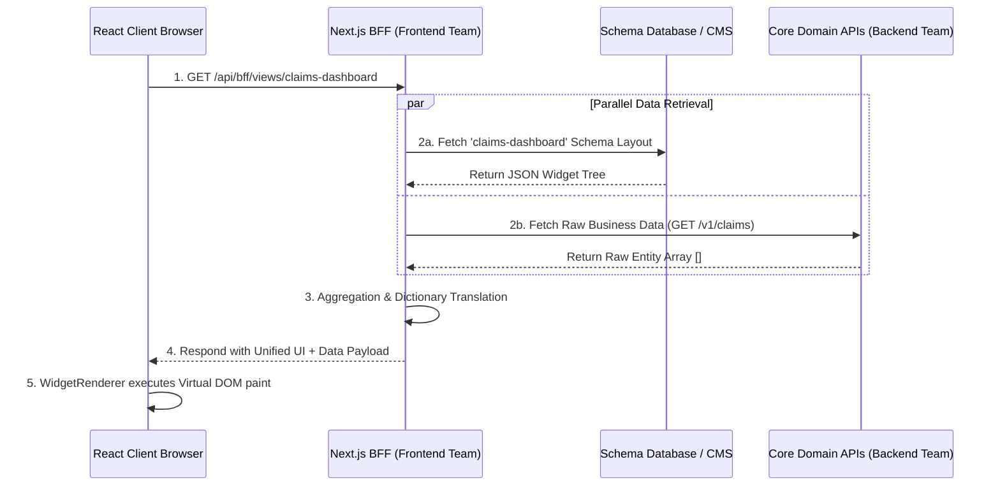

# Technical Specification: Server-Driven UI (SDUI) via BFF Architecture

## Document Control
| Field | Value |
|---|---|
| **Author** | Architecture Team |
| **Status** | Proposed / Draft |
| **Target Audience** | Frontend Engineers, Backend Engineers, Tech Leads |

---

## 1. Introduction & Problem Statement

### 1.1 Context
Historically, frontends have hardcoded UI layouts into their codebases (e.g., statically imported JSON schemas or defined React components). When product requirements demand UI updates—such as adding a visual widget, altering column layouts, or changing user journeys—it necessitates front-end development, full code reviews, build staging, and complex deployment lifecycles.

### 1.2 Proposed Solution (SDUI)
**Server-Driven UI (SDUI)** resolves this bottleneck by shifting UI definition *out* of compiled frontend code and into dynamically served data over the network. The frontend client transforms into a versatile "dumb renderer" (`WidgetRenderer`) specialized exclusively in recursively parsing and painting JSON schemas provided by the server.

### 1.3 The Role of the Backend-for-Frontend (BFF)
A naive architectural approach would offload UI schema generation to the **Core Backend Team**. This is a well-known anti-pattern. If the core domain APIs serve UI schemas, they become polluted with frontend-specific concerns (e.g., "button colors", "screen layouts"). 

To enforce domain purity, we are introducing a **Backend-for-Frontend (BFF)**. The BFF—owned explicitly by the Frontend Team and hosted within the Next.js API layer—acts as the integration conduit. It fetches physical UI schemas (from a DB or CMS), retrieves raw business data (from Core Backend APIs), and synthesizes a single, perfectly formatted JSON payload for immediate client rendering.

---

## 2. High-Level Architecture

The below schematic demonstrates the orchestration layer separating the client browser from core domain services.



---

## 3. Team Responsibilities & Ownership Boundaries

Enforcing strict domain boundaries is critical for the success of this architecture.

### 3.1 Frontend Team Responsibilities (Next.js BFF & Client)
- **Schema Lifecycle Management:** Defining, authoring, and versioning the JSON UI schemas within the CMS or Schema Registry.
- **BFF Orchestration:** Engineering the `/api/bff/*` endpoints. This includes routing, parallel data fetching, error handling, and timeout configurations.
- **Translation & Mapping:** Translating backend state enums into frontend view-models (e.g., transforming a core database enum `PAYMENT_FAILED` into localized strings with specific icon configurations).
- **Client Render Engine:** Maintaining the extensible `WidgetRenderer` engine built in React.

### 3.2 Core Backend Team Responsibilities (Domain Services)
- **Agnostic Domain APIs:** Engineering high-performance robust REST, gRPC, or GraphQL endpoints mapped cleanly against the business domain (e.g., User Profiles, Claims Processing).
- **Zero UI Leakage:** Emitting pure state. The core backend APIs must *never* return frontend implementation details such as hex colors, component types, or layout structures.
- **Service Level Agreements (SLAs):** Given the BFF proxies these requests, the Core APIs must adhere to strict latency margins to prevent aggregate slowdowns on the client UI.

---

## 4. Detailed System Workflows

### 4.1 Initial Render & Aggregation Pipeline
When a client application initiates a route transition (e.g., navigating to `/claims-dashboard`), the orchestration flows as follows:

1. **Client Request**: The browser requests a synthesized view (`GET /api/bff/views/claims-dashboard`).
2. **Retrieval**: The BFF queries the Schema Registry to determine what UI widgets comprise the dashboard, subsequently inferring the required backend data dependencies.
3. **Fetching**: The BFF interrogates the necessary Core API routes.
4. **Aggregation and Translation**: The Core Backend delivers raw, domain-specific JSON to the BFF. The BFF translates this data into a presentation-ready format before merging it into the UI schema's `dataSource`.
    - *Where is the map?* Translation dictionaries (e.g., mapping `"P"` to a Badge `{ label: "Pending", color: "yellow" }`) live within the BFF codebase. They are structured as view-model mapping utilities within the Next.js server environment.
    - *Maintenance:* Updates occur via standard Pull Requests to the Next.js frontend repository. If design terminology shifts, a frontend engineer updates the BFF mapper—requiring zero Core Backend deployment.
    - *Accountability:* The **Frontend Team** possesses full domain ownership over this translation layer.

### 4.2 Handling User Interactions & Partial Updates
A common fallacy regarding SDUI is the assumption of full-page refreshes upon widget interaction. This architecture maintains Single Page Application (SPA) paradigms through **Partial Schema Updates**.

1. **Mutation Trigger:** A user clicks a "Submit Approval" button.
2. **Async Call:** The client dispatches a mutation payload to the BFF (`POST /api/bff/actions/approve-claim`).
3. **Execution:** The BFF proxies the command to the Core Backend and evaluates the response.
4. **Targeted Schema Patch:** Instead of repainting the entire viewport, the BFF responds with a surgical Schema Patch or a Targeted Widget Schema (e.g., JSON definitions for a top-level Success Banner, alongside updated row data for the Data Table).
5. **Virtual DOM Reconciliation:** The React `WidgetRenderer` identifies the patched `componentId` strings and leverages Virtual DOM diffing to seamlessly inject or update *only* those targeted visual boundaries.

---

## 5. API Contracts & Translation Mechanics

This section illustrates the explicit transformation occurring within the BFF middleware layer.

### 5.1 The Core Backend Output (To BFF)
The Core API serves unformatted data entities.
```json
// GET api.core.internal/v1/claims?limit=2
{
  "total": 500,
  "results": [
    { "claimId": "C-1004", "status": "APPROVED", "amountCents": 50000 },
    { "claimId": "C-1005", "status": "PENDING", "amountCents": 12500 }
  ]
}
```

### 5.2 The BFF Output (To Client Browser)
The BFF returns an actionable view-model, unifying the Schema layout with formatted data and component directives.
```json
// GET frontend.app.com/api/bff/views/dashboard
{
  "viewId": "dashboard-main",
  "layout": "vertical-stack",
  "components": [
    {
      "id": "claims-summary-table",
      "type": "data-table",
      "props": {
        "title": "Recent Claims Dashboard",
        "columns": [
          { "accessorKey": "claimId", "label": "Reference No.", "type": "text" },
          { "accessorKey": "formattedAmount", "label": "Settlement", "type": "currency" },
          { "accessorKey": "status", "label": "Current Status", "type": "badge" }
        ]
      },
      "data": [
        { 
          "claimId": "C-1004", 
          "formattedAmount": "$500.00", 
          "status": { "label": "Approved", "color": "green" } 
        },
        { 
          "claimId": "C-1005", 
          "formattedAmount": "$125.00", 
          "status": { "label": "Pending", "color": "yellow" } 
        }
      ]
    }
  ]
}
```

---

## 6. Architectural Mitigations & Production Readiness

While this architecture significantly liberates product delivery, it introduces complexity into the middleware orchestration tier. The following mitigations must be rigorously adopted.

### 6.1 Caching Strategies
- **Schema Resolution:** UI layouts are highly static. The BFF must aggressively cache schema definitions at the Edge or via in-memory Redis stores, expiring via CMS webhook invalidations rather than TTL strategies.
- **Data Resolution:** Implement HTTP `stale-while-revalidate` (SWR) headers dynamically in the BFF to prevent overloading critical Core APIs on heavy read-path views.

### 6.2 Contract Validation & Drift Prevention
- **Typing Integrity:** The BFF relies heavily on a presumed JSON shape emitted by the Core Backend. A renamed field (e.g., `amountCents` to `amount_cents`) risks critically crashing the UI aggregation.
- **Mitigation:** Employ Consumer-Driven Contract Testing (e.g., Pact). Furthermore, enforce rigorous Zod validation schemas at the boundaries of the BFF to catch structure drift and fail gracefully before shipping corrupt view-schemas to the browser.

### 6.3 Mitigating Waterfall Latency (eventual)
- **The Waterfall Risk:** BFF orchestration necessitates sequential dependency resolution (`Wait for Schema -> Infer Data Req -> Wait for Data -> Aggregate`).
- **Mitigation:** Schema resolution must be optimized to `< 5ms` (see *6.1 Caching*). For computationally heavy pages, the BFF should utilize React Server Components (RSC) and Streaming architectures—delivering the static HTML shell immediately and progressively streaming parameterized widget data as downstream Core APIs resolve.
