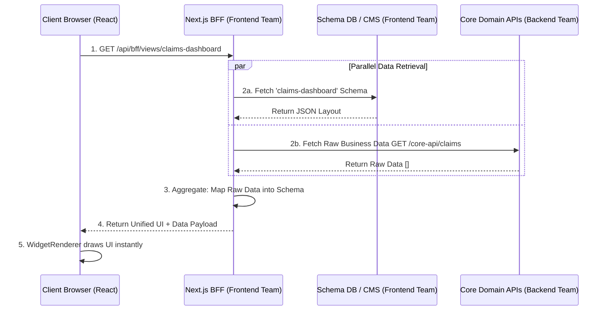

# Server-Driven UI Architecture via BFF (Backend-for-Frontend)

## 1. Executive Summary & The "Why"

Historically, frontends have hardcoded UI layouts into their codebases (e.g., storing a `dashboardSchema.json` locally or hardcoding React components). Every time a product manager wanted to add a new column to a table, hide a form field, or orchestrate a new user journey, it required front-end development, code review, a build process, and a deployment.

**Server-Driven UI (SDUI)** solves this problem by shifting the definition of the UI *out* of the compiled frontend code and into data that is served dynamically over the network. Under SDUI, the frontend merely acts as a "dumb renderer" (our `WidgetRenderer`) that recursively draws whatever JSON schema it receives from the server.

### Why a BFF (Backend-for-Frontend)?

We could theoretically ask the Core Backend Team (who writes our business logic in Java/Go/Node) to serve these UI schemas. However, **this is an anti-pattern**. The Core Backend should solely concern itself with business logic, data persistence, and domain modeling. If the Core Backend serves UI JSON, it becomes polluted with UI-specific concerns like "button colors", "screen layouts", and "table column widths."

By introducing a **Backend-for-Frontend (BFF)**—which is owned by the Frontend Team and lives within the Next.js API ecosystem—we create a perfect separation of concerns.

The BFF's job is to:
1. Fetch the physical UI configuration layout (the Schema) from a database or CMS.
2. Fetch the raw business data from the Core Backend APIs.
3. Stitch them together into a single, perfectly formatted JSON payload.
4. Deliver this payload to the client for immediate rendering.

---

## 2. The Architectural Flow

Here is a visual representation of how a single user request flows through the proposed architecture.



### Flow Walkthrough (For Junior Engineers)

Imagine you, the user, navigate to `/claims-dashboard`.

1. **The Client Request**: Your browser doesn't know what this page looks like. It makes a single API call to our Next.js backend: `GET /api/bff/views/claims-dashboard`.
2. **Schema Retrieval**: The BFF needs to know what UI widgets belong on this page. It queries our Schema Registry (or a headless CMS) for the layout. It sees that this page needs a "Data Table Widget" and a "Summary Card Widget".
3. **Data Retrieval**: Knowing what widgets exist, the BFF knows what data is required. It calls the Core Backend's `/claims` endpoint.
4. **Aggregation (The Magic)**: The Core Backend returns raw, boring JSON like `[{"id": 1, "amt": 500, "status": "P"}]`. The BFF translates this. It takes the "P" and maps it to a "Pending" UI Badge component defined in the schema. It takes the raw data and inserts it directly into the schema's `dataSource` field.
5. **Client Render**: The React frontend receives one massive object. It simply says "Oh, a Table Widget with this data! Oh, a Summary Card with this text!" and paints the screen in one unified pass.

---

## 3. Strict Team Responsibilities

To make this architecture succeed, we enforce strict boundaries between engineering orgs.

### Frontend Team (Owning the Next.js BFF and Client UI)
- **Schema Management:** Defining, authoring, and versioning the JSON UI schemas. If a new filter dropdown needs to be added to a page, the Frontend team builds the schema for it.
- **BFF Orchestration:** Building the `/api/bff/*` endpoints. This is the glue code that calls the backend, parses the schema, and merges them.
- **Data Mapping & Presentation Logic:** Translating backend states into frontend concepts. For example, turning a backend enum `PAYMENT_FAILED` into a localized string `"Payment Failed"` with a red icon `"TriangleWarning"`.
- **Client Render Engine:** Maintaining the React `WidgetRenderer` that recursively traverses the BFF payload on the client side.

### Core Backend Team (Owning Domain Services)
- **Agnostic Domain APIs:** Building robust, standard REST or GraphQL endpoints (e.g., `GET /v1/users/123`).
- **Zero UI Knowledge:** Complete ignorance of the UI. The core backend APIs should **never** return field names like `textColor`, `columnWidth`, or `isButtonDisabled`. They emit pure state, leaving the BFF to decide how that state translates to the screen.
- **High Performance:** Ensuring Core APIs are fast and reliable. Because the BFF proxies these requests, any latency in the Core Backend is passed directly to the user.

---

## 4. Deep Dive: The API Contract Example

Let's look at exactly what occurs over the wire. This example illustrates the difference between what the Core APIs return and what the BFF returns to the browser.

### What the Core Backend returns to the BFF
*(Pure data, no UI knowledge)*
```json
// GET api.core.com/v1/claims?limit=2
{
  "total": 500,
  "results": [
    { "claimId": "C-1004", "status": "APPROVED", "amountCents": 50000 },
    { "claimId": "C-1005", "status": "PENDING", "amountCents": 12500 }
  ]
}
```

### What the BFF returns to the React Client
*(The BFF has fetched the layout schema, fetched the data above, formatted the currency, and injected it into the table component).*
```json
// GET keystone-ui.com/api/bff/views/dashboard
{
  "viewId": "dashboard-main",
  "layout": "vertical-stack",
  "components": [
    {
      "id": "claims-summary-table",
      "type": "data-table",
      "props": {
        "title": "Recent Claims Dashboard",
        "columns": [
          { "accessorKey": "claimId", "label": "Claim Reference Number", "type": "text" },
          { "accessorKey": "formattedAmount", "label": "Settlement Amount", "type": "currency" },
          { "accessorKey": "status", "label": "Current Status", "type": "badge" }
        ]
      },
      "data": [
        { 
          "claimId": "C-1004", 
          "formattedAmount": "$500.00", 
          "status": { "label": "Approved", "color": "green" } 
        },
        { 
          "claimId": "C-1005", 
          "formattedAmount": "$125.00", 
          "status": { "label": "Pending", "color": "yellow" } 
        }
      ]
    }
  ]
}
```

Notice how the client doesn't need to do *any* logic. It doesn't format the `$500.00`, and it doesn't figure out that `APPROVED` means a green badge. The BFF handled all business translation. 

---

## 5. Architectural Mitigations (For Tech Leads)

While this architecture unblocks the frontend team and purifies the backend, it shifts massive complexity into the Next.js BFF. Tech Leads must account for the following architectural risks.

### 5.1 Caching Strategy
**Risk:** If the BFF fetches schemas from a database and data from core APIs on every single page load request, our infrastructure load will double and p99 latency will spike.
**Mitigation:** 
- **Schema Caching:** UI Schemas change infrequently. The BFF must aggressively cache schema definitions in-memory (using `node-cache`) or via Redis (Upstash) with a long TTL (e.g., 1 hour), utilizing webhook invalidations when a PM updates a schema in the CMS.
- **Data Caching:** To prevent over-burdening core APIs, utilize Next.js `fetch` `stale-while-revalidate` caching semantics for data that isn't mission-critical real-time.

### 5.2 Contract Testing
**Risk:** The BFF relies on the Core Backend's JSON shape. If the Backend renames `amountCents` to `amount_cents`, the BFF's aggregation mapping breaks, crashing the entire UI.
**Mitigation:** 
- We must establish rigorous consumer-driven contract testing (e.g., using Pact) between the BFF and the Core APIs. The BFF should enforce strict Zod schemas when parsing Core Backend responses, throwing 500s or gracefully degrading *before* passing corrupt schema payloads to the client.

### 5.3 Parallel Fetching vs. Waterfalling
**Risk:** The BFF must fetch the schema first to know *what* data to fetch, creating a mandatory network waterfall (`Fetch Schema -> Await -> Fetch Data -> Await -> Return`).
**Mitigation:**
- Because schemas will be cached at the edge/in-memory, the schema "fetch" should resolve in `< 5ms`.
- For deeply nested dynamic widgets where data dictates further schema loads, implement progressive rendering. Send the shell of the page first, and stream the deeper dynamic sections over React Server Components (RSC) or Suspense boundaries.
