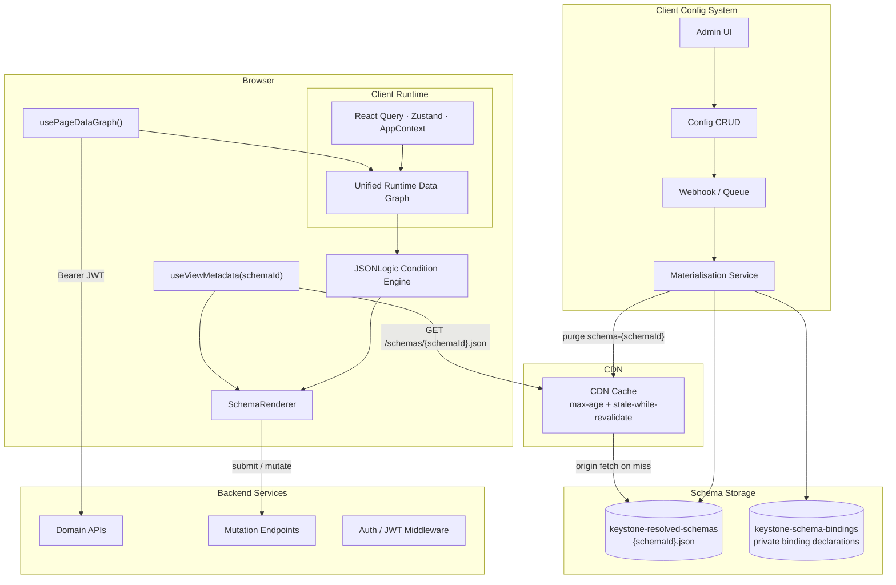

# Keystone UI — System Design v0

**Status:** Proposed  
**Date:** 2026-04-23  
**Audience:** Tech leadership, frontend platform, module teams  
**Detail docs:** [`./`](./README.md)

---

## What This System Is

Keystone UI is a metadata-driven UI architecture for the initial on-prem deployment.

Every page is described by a resolved schema identified by a unique `schemaId`. The browser fetches that schema directly from CDN/S3, fetches domain data directly from backend APIs, evaluates schema-authored JSONLogic conditions against a unified runtime data graph, and renders a widget tree.

This architecture uses:

- browser-based UI assembly
- pre-materialised display semantics in schema
- direct backend integration from the browser
- contract validation and observability around API responses

It intentionally excludes:

- no `useFieldConfig()` flow because conditions are static and pre-known
- no `useWorkbenchBootstrap()` flow because workbench pages are out of scope
- no context-based schema selection service because schemas are fetched directly by unique `schemaId`

---

## The v0 Shape

The architecture has three browser-side flows and one server-side publication flow.

### Browser flows

1. **Schema delivery** via `useViewMetadata(schemaId)`
2. **Page data loading** into one unified runtime data graph
3. **Mutations** against backend APIs, with backend validation on every write

### Server-side publication flow

4. **Config save -> materialisation -> CDN purge -> fresh resolved schema artifact**

---

## Full System



---

## Walking Through the System

### Step 1 — The browser fetches the resolved schema

The browser calls `useViewMetadata(schemaId)`. The request goes directly to CDN. On a cache miss, CDN fetches `keystone-resolved-schemas/{schemaId}.json` from storage and returns it to the browser.

There is no Worker in the delivery path, no JWT decode at schema-fetch time, and no runtime schema-selection service.

The delivery mechanism is intentionally simple:

- one resolved schema artifact per `schemaId`
- one CDN path per artifact
- no delivery-time filtering or context matching
- browser never sees raw binding declarations or config keys

### Step 2 — The runtime builds one data graph for the page

The schema declares named data sources. The runtime hydrates those sources into one unified runtime data graph. Widgets do not read directly from raw endpoint responses. They bind to graph paths.

That gives the page one read contract even if many API calls are needed.

### Step 3 — Schema conditions are evaluated locally

Conditions are static JSONLogic rules authored in schema from the product specs. They are evaluated locally against the runtime data graph.

Conditions may shape:

- widget visibility
- field visibility
- field required-state
- field editability
- convenience UI behavior tied to known state

Conditions are the preferred mechanism for UX differences. Variants are allowed only when a UX difference cannot be modeled cleanly and maintainably as a condition.

### Step 4 — The renderer mounts the widget tree

The schema is a widget tree. Forms are widgets. Fields are child widgets within form widgets.

Nodes resolve data in three ways:

1. bind to a graph path
2. inherit from parent scope
3. read inline schema values

### Step 5 — Backend APIs validate writes

The backend does not provide a dedicated workflow contract in v0. State-driven UI behavior is described in schema and evaluated against ordinary API state.

But the backend still validates every write.

The rule is:

**schema shapes the UX for known states; backend APIs remain the enforcement point for submitted mutations.**

### Step 6 — Display semantics are still pre-materialised

Labels, translations, badge variants, and other display mappings remain in the Config System. When config changes, the materialisation service rewrites affected resolved schema artifacts and purges CDN cache tags.

This is how display semantics are delivered in the architecture.

---

## What Is In Scope

This architecture is designed for:

- dashboards
- queues
- admin pages
- list-detail pages
- lightweight and medium-complexity forms
- schema-driven UX shaped mainly by static conditions

## What Is Out of Scope

This architecture does not include:

- dedicated workbench runtime
- bootstrap APIs for coherent multi-panel screens
- field-rule fetch APIs
- backend-driven workflow capability contracts
- dynamic rule authoring by business users
- multi-tenant schema selection and filtering

---

## Core Design Principles

**Schema is the page contract.** It declares the widget tree, data bindings, conditions, inheritance rules, and variants where necessary.

**Conditions first, variants second.** If a UX difference can be expressed cleanly as a condition, use a condition. Introduce a variant only when the difference cannot be expressed cleanly and maintainably that way.

**Variants are explicit schema artifacts in the POC.** If a variant exists, it has its own `schemaId` and is selected explicitly by route or configuration rather than by a runtime resolver.

**Display semantics are server-resolved.** The browser receives ready-to-render labels and display mappings.

**The UI reads one runtime graph.** Even when data comes from many sources, the consumer contract is one graph.

**Backend validation remains authoritative.** Schema logic can shape presentation but not replace server-side mutation validation.

**Keep v0 intentionally narrow.** Avoid reintroducing generic workflow engines, dynamic field-rule systems, or unconstrained schema execution.

---

## Operational Guarantees

This architecture adopts the following operating targets for the deployment model.

| Area | Target | Notes |
|---|---|---|
| Schema fetch, warm CDN | p95 < 30ms | CDN hit path |
| Schema fetch, cold origin | p95 < 150ms | CDN miss plus S3 fetch |
| Schema availability | 99.9% monthly | Last-known-good schema served where possible |
| Config save to fresh schema availability | p95 < 120s | Includes materialisation and CDN purge |
| Unknown config gap alerting | < 1 min | Gap event to monitoring pipeline |
| Contract violation alerting | < 5 min | Sentry/Datadog/PagerDuty path |
| Hotfix rollback execution | < 15 min | Break-glass and versioned object restore |

These are targets, not guarantees of zero incidents. They are the basis for monitoring and escalation.

---

## Major Tradeoffs

**Schema becomes more load-bearing.** This is acceptable in v0 because conditions are stable and product-specified.

**Runtime graph discipline becomes critical.** Without naming and binding conventions, the graph will drift and the simplification will erode.

**Variant sprawl is a real risk.** The architecture explicitly prefers conditions to prevent exploding numbers of schema artifacts.

**No workbench support in v0 is a conscious scope cut.** The architecture is coherent because it refuses that complexity rather than pretending to support it partially.

**Static conditions are the principal architectural bet.** v0 assumes most condition logic is stable, known from specs, and can move through the schema publication cycle. If that assumption breaks and rule changes begin happening frequently and independently of schema publication, the next step should be a narrowly scoped dynamic rule layer rather than stretching schema conditions indefinitely.

**Direct schema delivery assumes schemas are non-sensitive metadata.** If that assumption changes, schema delivery will need signed or otherwise protected access rather than a static CDN path.

---

## Documents In This Set

```text
docs/arch_v0/
  README.md
  00-SYSTEM-DESIGN.md
  01-SCHEMA-DELIVERY.md
  02-AUTH-AND-SECURITY.md
  03-CONFIG-AND-MATERIALISATION.md
  04-RUNTIME-AND-CONDITIONS.md
  05-CONTRACTS-OBSERVABILITY-AND-OPERATIONS.md
  06-ONBOARDING-AND-LIFECYCLE.md
  07-ARCHITECTURE-COMPLETENESS.md
  08-SCHEMA-AUTHORING-AND-REVIEW.md
  09-DECISIONS-SUMMARY.md
```
