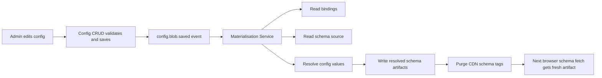

# Config And Materialisation

**Parent:** [`00-SYSTEM-DESIGN.md`](./00-SYSTEM-DESIGN.md)

This document covers the display-semantic side of the architecture.

---

## Overview

The Config System owns display semantics:

- labels
- translations
- badge variants
- display lookup maps
- other non-business display mappings

The backend owns domain codes. The Config System owns what those codes look like to users.

---

## Why This Exists

The Config System remains essential because it solves a different problem than runtime conditions:

- display changes without frontend deploys
- pre-resolved schema artifacts served from CDN
- separation between domain codes and user-facing semantics

---

## Data Model

Config blobs are keyed values under governed namespaces.

Examples:

```text
insurance.quotation.status.PENDING_APPROVAL
insurance.quotation.status.DRAFT
ui.common.empty_state.no_results
```

Config values are deployment-wide.

---

## Publication Flow



---

## Materialisation Rules

The materialisation service:

- consumes config save events
- finds affected bindings
- resolves all referenced config values
- writes fresh resolved schema artifacts atomically
- emits monitoring and completion events
- triggers CDN purge by schema tag

It does not:

- serve browser traffic
- leak binding declarations to the browser
- write partial or in-progress schema files

---

## CDN Purge Strategy

### Purge key

- `schema-{schemaId}`

### Batching policy

- collect all affected schema keys for one materialisation batch
- collapse duplicate purge tags before submitting purge requests
- send purge requests in bounded batches
- apply jitter between very large purge batches to avoid thundering herds

### Monitoring

Track:

- purge request count
- purge batch size
- purge latency
- schema fetch miss rate after purge
- queue depth during large fan-out events

---

## Governance Summary

### Key rules

- config keys are immutable identifiers
- keys follow governed naming conventions
- namespace ownership is explicit
- key renames are migrations, not edits
- unknown values fall back safely and emit alerts

### Approval workflow

Protected namespaces require owner approval for production changes. At minimum:

- namespace owner approves key creation in protected domains
- production config edits are recorded with actor, key, and diff
- break-glass edits are called out separately in the event log

### Resilience

The config datastore and resolved schema storage must support:

- object versioning
- backup or point-in-time recovery for config data
- artifact restore for resolved schemas

For the POC, this is an environment-level resilience requirement rather than a multi-region requirement.

---

## Unknown Value Fallback

If a config mapping is missing for a new domain code, the materialisation output should fall back to:

```json
{ "label": "<raw_value>", "variant": "neutral" }
```

and emit:

- config gap event
- alert for config owners

---

## Disaster Recovery For Materialisation Failure

### Guarantees

- schema artifacts are replaced atomically
- last-known-good schema remains available because old object versions still exist
- failed events stay visible through queue age and retry metrics

### Watchdogs

Monitor:

- oldest unprocessed config event age
- materialisation error rate
- schema `resolvedAt` freshness by `schemaId`
- count of artifacts older than freshness threshold after a config save

### Recovery path

1. replay failed event
2. re-materialise affected schemas
3. purge affected cache tags again
4. if replay cannot recover quickly, restore prior schema object version and open incident

---

## Hotfix Tolerance

Direct edits in the resolved schema bucket are not the normal operating model.

Policy:

- normal path: no direct edits
- break-glass path: allowed under incident procedure only
- all break-glass edits must be back-ported to schema source and bindings

That provides operational tolerance without normalizing drift between source-of-truth and served artifacts.
