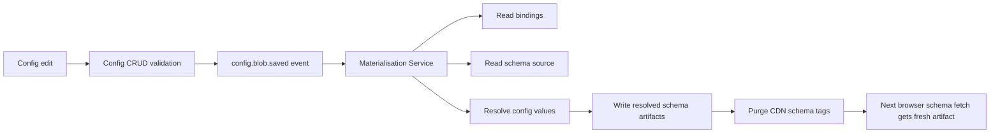

# Config And Materialisation Proposal

**Parent:** [`00-SYSTEM-DESIGN.md`](./00-SYSTEM-DESIGN.md)  
**Status:** Proposal for engineering review

This document is a proposal for the display-semantics and schema-materialisation part of the architecture.

It is not describing a finished system already in place.

For the initial architecture, we are assuming a system like this will exist. This document is the proposed shape of that system so engineering can review, refine, and plan delivery.

---

## Proposal Summary

We propose introducing a Config System plus a schema materialisation pipeline to own all display semantics that should not live in component code.

That means:

- backend APIs continue to return domain codes
- display labels, translations, badge variants, and similar UI semantics are managed separately
- resolved schema artifacts are generated with those values baked in before they are published to CDN/S3

The browser should receive display-ready schema artifacts, not raw config keys or transformation rules.

---

## Why We Are Proposing This

This proposal exists to solve a specific problem:

- changing user-facing labels should not require frontend code changes everywhere
- display mappings should not be scattered through component switch statements
- the schema artifact should stay browser-ready
- UI semantics should be editable without changing domain API contracts

Without a system like this, the likely fallback is one of these worse options:

- hardcoded labels and mappings inside components
- domain-specific display logic leaking into APIs
- repeated display maps copied into many schemas

---

## What This Proposed System Would Own

The proposed Config System would own:

- labels
- translations
- badge variants
- display lookup maps
- other non-business display semantics

The backend would continue to own:

- domain codes
- domain state
- mutation validation
- business logic

The frontend/runtime would continue to own:

- widget tree rendering
- data binding
- condition evaluation

---

## Proposed Model

### 1. Config blobs

Config values are stored as keyed blobs under governed namespaces.

Examples:

```text
insurance.quotation.status.PENDING_APPROVAL
insurance.quotation.status.DRAFT
ui.common.empty_state.no_results
```

For the current deployment, config values are assumed to be deployment-wide.

### 2. Schema bindings

Schemas do not embed config values manually everywhere. They declare what config keys they need through binding declarations.

Example idea:

- schema binds `columns.status.valueMap` to `insurance.quotation.status`
- materialisation resolves that binding into a concrete map before publication

### 3. Materialised schema artifacts

The published schema artifact should already contain resolved display values.

The browser should not receive:

- raw config keys
- config-binding declarations
- transformation rules

---

## Proposed Publication Flow



This is the target operating model.

---

## Proposed Responsibilities

### Config System

Would be responsible for:

- CRUD over config values
- validation of key format and value shape
- emitting save events
- governance around keys and ownership

### Materialisation Service

Would be responsible for:

- consuming config save events
- reading schema bindings
- resolving config values into schema artifacts
- writing fresh resolved schema artifacts atomically
- triggering CDN purge by schema tag

It would **not**:

- serve browser traffic
- expose binding declarations to the browser
- write partial or in-progress artifacts

### Browser

Would continue to:

- fetch resolved schema by `schemaId`
- render the artifact as-is
- avoid any display-semantics transformation logic at runtime

---

## Proposed Governance Rules

If this system is built, these rules should be part of it from the start.

### Key rules

- config keys are immutable identifiers
- keys follow governed naming conventions
- namespace ownership is explicit
- key renames are migrations, not edits
- unknown values fall back safely and emit alerts

### Operational rules

- resolved schema artifacts are versioned
- materialised writes are atomic
- CDN purges are batched
- break-glass hotfixes are exceptional and audited

---

## Proposed Unknown Value Fallback

If a config mapping is missing for a new domain code, the materialised output should fall back to:

```json
{ "label": "<raw_value>", "variant": "neutral" }
```

And emit:

- a config gap event
- an alert for config owners

This keeps the UI rendering safely even when the config catalogue is incomplete.

---

## Operational Requirements If We Build This

If engineering adopts this proposal, the system should support at least:

- schema artifact versioning and rollback
- materialisation failure monitoring
- freshness monitoring using `resolvedAt`
- purge latency tracking
- break-glass rollback/hotfix procedure

This proposal should not be implemented as a best-effort utility with no operational model.

---

## Recommended Delivery Path

The safest way to build this is in phases.

### Phase 1 - Minimal viable materialisation

Build only what the architecture immediately needs:

- config value store
- schema bindings format
- one materialisation process
- resolved schema publication to S3/CDN
- manual or CLI-driven publishing path

At this phase, an admin UI is optional.

### Phase 2 - Operational hardening

Add:

- event-driven materialisation
- rollback tooling
- purge batching and monitoring
- schema freshness watchdogs
- config gap alerts

### Phase 3 - Full management experience

Add:

- admin UI for config management
- namespace ownership workflows
- migration tooling for bindings
- richer governance/reporting

This staged path is likely better than trying to build a full productized config platform before the runtime exists.

---

## Initial Assumption For The Architecture

Until engineering finalizes and builds this system, the architecture is making this assumption:

**a Config System plus materialisation pipeline will exist, and the browser will receive display-ready schema artifacts.**

That assumption is acceptable for architecture work, but it should stay visible. This document is the proposal that needs engineering buy-in behind that assumption.

---

## Open Questions For Engineering Review

These are the most important questions to answer before implementation starts.

1. Where should config values live initially: DB, object store, or repo-managed source?
2. Do we want event-driven materialisation from day one, or manual/CLI-triggered materialisation first?
3. Does the first version need an admin UI, or is an engineer-operated path enough?
4. How strict should publication-time validation be in the first phase?
5. What is the exact schema binding format we want to standardize on?
6. What is the rollback mechanism we want to bless operationally?

---

## Recommendation

My recommendation is:

1. accept this proposal as the target shape
2. implement a thin Phase 1 first
3. keep the browser contract fixed: resolved schema in, no runtime display transformation
4. harden the operational path before scaling schema count

That gives the architecture the boundary it needs without forcing engineering to build the full management platform on day one.
