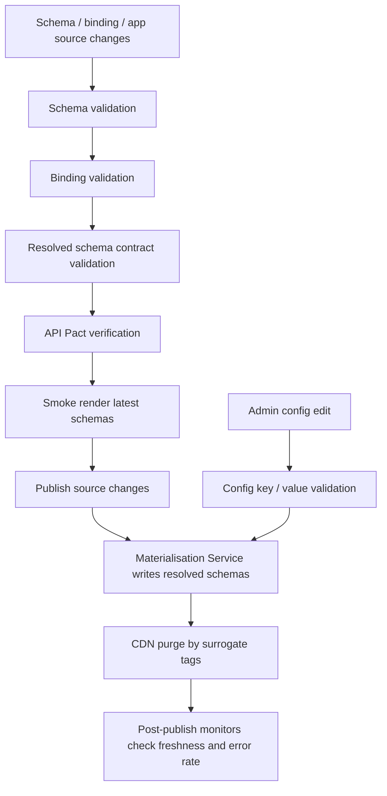

# Contracts, Observability, And Operations

**Parent:** [`00-SYSTEM-DESIGN.md`](./00-SYSTEM-DESIGN.md)

This document closes the operational and governance gaps identified in the system-design review.

---

## Contract Enforcement

v0 keeps the existing two-layer contract model.

### 1. Pact in CI

- frontend defines API expectations
- backend verifies compatibility before deployment
- incompatible backend changes fail CI instead of breaking production users

### 2. Zod in the browser

- all API responses validated before entering the runtime graph
- contract violations reported to Sentry and Datadog
- typed errors surface failures quickly

### 3. Resolved schema validation

Resolved schemas also need contract validation, not just API responses.

v0 therefore requires:

- a Zod schema for resolved schema artifacts
- validation at schema fetch time
- publication-time validation before a resolved schema object is written

### 4. Smoke rendering

The review asked for validation beyond Pact. v0 adds smoke rendering:

- fetch latest resolved schemas from a staging bucket
- render them in a headless smoke harness
- fail CI if render contract breaks

This catches problems that are structurally valid JSON but no longer render correctly in the UI.

---

## Observability Model

The review asked for clearer metrics. v0 defines them explicitly.

### Edge and schema delivery

- schema fetch latency
- CDN hit ratio
- Worker cache source (`cdn`, `kv`, `origin`)
- schema `404` count
- schema `503` count
- stale schema served count

### Config and materialisation

- config save rate
- materialisation duration
- queue depth and oldest event age
- purge latency
- schema freshness lag (`now - resolvedAt`)
- config gap count

### Client runtime

- API contract violations
- resolved schema contract violations
- condition evaluation failures
- graph hydration latency per source
- mutation failure rate

### Alerting thresholds

- repeated schema `503` beyond 5 minutes -> page platform on-call
- queue age above freshness SLO -> config/materialisation on-call
- any resolved-schema contract violation in production -> immediate alert

---

## Release Pipeline

The review explicitly asked for a release pipeline diagram.

There are two publication paths in v0:

1. **Source-managed path** for schema, binding, and application changes
2. **Admin-managed config path** for display-semantic changes in the Config System

### Path differences

**Source-managed path:**

- runs full CI validation
- covers schema source, bindings, and code changes

**Admin-managed config path:**

- does not run repo CI
- must still pass Config System validation, materialisation validation, resolved-schema validation, and post-publish freshness checks

### Deployment gates

Do not publish if any of these fail:

- schema contract validation
- binding validation
- resolved-schema Zod validation
- Pact verification
- smoke render
- artifact size budget
- accessibility schema checks

---

## Disaster Recovery

The review asked for an explicit DR answer.

### If Worker or storage fails

- serve stale schema where available
- return `503` only when no stale response exists
- monitor edge error rate and stale-serving rate

### If materialisation lags or fails

- keep serving last-known-good schema object versions
- replay queue messages
- restore prior object versions if needed

### If bad schema reaches production

Recovery order:

1. fast rollback to prior object version
2. purge affected surrogate tags
3. back-port source correction
4. re-materialise and republish

---

## Hotfix Policy

Direct edits to resolved schema artifacts are break-glass only.

Requirements:

- active incident or severe customer impact
- named incident owner
- named approver
- audit trail captured
- source back-port within one working day

This policy answers the review question about whether direct bucket hotfixes are tolerated: yes, but only under controlled incident procedure.

---

## Audit And Compliance Notes

The review asked for regulator-facing considerations.

### Required controls

- no PII in schema artifacts
- token scope minimised to claims actually needed by the browser
- raw payload logging truncated and sanitized
- config changes fully audited
- mutation endpoints audited according to domain severity

### Retention and evidence

Retention belongs to platform policy, but this architecture requires that:

- schema publication events are traceable
- config changes are attributable
- break-glass actions are separately marked

---

## Explicit v0 Scope Notes

The earlier review mentioned bootstrap payload budgets. In v0, this is out of scope because workbench/bootstrap architecture is not part of the initial version.

The equivalent v0 concern is instead:

- resolved schema artifact size
- data-source count per page
- eager versus deferred source budgets

Those are the budgets this document governs.
