# 01 — Architecture

This document explains *how the framework works at runtime* — not how to write a schema, but what happens when one renders. Read this first; everything else assumes it.

---

## The big picture

```mermaid
flowchart TD
    Page["<b>Next.js page</b> (src/app/&lt;route&gt;/page.tsx)<br/>• imports a schema JSON file<br/>• resolves $refs (server-side, via resolveSchemaRefs)<br/>• substitutes route params (e.g. &#123;&#123;id&#125;&#125;) into endpoints<br/>• passes the resolved config to &lt;WidgetRenderer /&gt;"]
    Renderer["<b>&lt;WidgetRenderer config=&#123;...&#125; /&gt;</b><br/>1. Look up config.type in WidgetRegistry<br/>2. If config.dataSource exists, useSmartQuery() fetches it<br/>3. If config.layout.hidden, return null<br/>4. Merge fetched data into props and render the component<br/>5. Component recurses into its own children (or props.items)"]
    Layout["Layout<br/>widgets"]
    Data["Data<br/>widgets"]
    Form["Form<br/>widgets"]
    Action["Action<br/>widgets"]
    Handler["<b>useActionHandler()</b><br/>• navigate<br/>• api-mutation<br/>• open-modal<br/>• …"]
    Hooks["<b>Cross-cutting hooks</b><br/>• useWidgetState (shared zustand)<br/>• useRole (role context)<br/>• useOverlayStore (modal/sheet)<br/>• useSmartQuery (data + polling)"]

    Page --> Renderer
    Renderer --> Layout
    Renderer --> Data
    Renderer --> Form
    Renderer --> Action
    Action --> Handler
    Layout --> Hooks
    Data --> Hooks
    Form --> Hooks
    Handler --> Hooks
```



That's the whole runtime in one diagram. Everything below this line is detail.

---

## Why schema-driven?

Three reasons, in order of importance:

1. **Most insurance screens are CRUD with workflow gates.** A list, a detail view, a form to edit, a few buttons that fire on certain states. Describing this in JSON beats writing the same React patterns 50× across modules.
2. **The widget surface stays bounded.** When new requirements come in, the first question is "does an existing widget cover this?" not "how do I structure a new component?" The cost of adding a new module is mostly the cost of writing JSON and an API route.
3. **Schemas are versionable and reviewable.** A diff to `schemas/claims-detail.json` is human-readable and obviously a UI change. A diff to a 600-line React file with state, effects, and conditional JSX is not.

The trade-off is that the runtime is opinionated — you fit your screen to the widget vocabulary, you don't reach for arbitrary React. When that's a wrong fit, you have two options: compose differently, or add a new widget. **Don't fork the framework for one feature.** See [11-cookbook.md → "Recipe: Register a new widget"](11-cookbook.md).

---

## File map

| Path | What lives here |
|------|-----------------|
| `schemas/*.json` | Top-level page schemas (one per route): `quotations.json`, `claims-list.json`, `dashboard.json`, … |
| `schemas/tabs/<module>/*.json` | Tab-panel schemas referenced via `$ref` from page schemas |
| `schemas/forms/*.json` | Form schemas, looked up by id at runtime |
| `schemas/forms/index.ts` | **Auto-generated** registry (do not edit by hand) — see [06-forms.md](06-forms.md) |
| `scripts/generate_form_index.mjs` | Generator for the forms registry (runs on `npm run predev`) |
| `src/app/<route>/page.tsx` | Next.js page — imports the schema, resolves refs, renders |
| `src/app/api/<path>/route.ts` | Mock API routes (or proxies to real backend) |
| `src/components/registry/WidgetRenderer.tsx` | The recursive renderer |
| `src/components/registry/WidgetRegistry.tsx` | The `type` → component map |
| `src/components/widgets/<category>/*` | Widget components themselves |
| `src/components/ui/*` | Primitive UI components (Button, Card, Badge, Tooltip, …) — used *inside* widgets |
| `src/hooks/*` | The cross-cutting hooks: `useSmartQuery`, `useActionHandler`, `useWidgetState`, `useRole`, `useOverlayStore`, `useDataTable`, `useTableExport`, `use-mobile` |
| `src/components/widgets/forms/formContainer/useFormContainer.ts` | The forms-only hook — co-located with the `form-container` widget rather than living in `src/hooks/` |
| `src/types/widget.ts` | `WidgetConfig`, `DataSourceConfig`, `ActionConfig` type definitions — the source of truth for schema shape |
| `src/lib/schemaResolver.ts` | `resolveSchemaRefs()` — walks `$ref` shortcuts |
| `src/lib/endpointUtils.ts` | `substituteEndpointParams()` — replaces `:param` tokens with row data |
| `src/lib/conditions.ts` | `evaluateCondition()` — JSONLogic wrapper for visibility / `stopWhen` |
| `src/lib/polling.ts` | `STANDARD_POLL_SCHEDULE` constant + helpers for `pollSchedule` configs |
| `src/lib/api/client.ts`, `error-mapper.ts`, `index.ts` | Generic typed API client + Spring/QuotationException error envelope mapping. See [09-api-routes.md → Typed API client](09-api-routes.md). |
| `src/components/layout/DetailPageSkeleton.tsx` | Shared Suspense fallback for detail routes — mirrors page-header + first-widget shape so load-to-content is smooth. |
| `src/app/globals.css` | Design tokens (colours, radii, spacing) — see [10-design-system.md](10-design-system.md) |

**Additional infrastructure on `feat/new-buisiness` (Group PAS domain code):**

| Path | What lives here |
|------|-----------------|
| `src/lib/api/quotation.ts`, `issuance.ts`, `policy-admin.ts`, `productCatalog.ts` | Domain-typed API modules per backend bounded-context |
| `src/lib/api-mock/group-pas/` | The Group PAS mock backend — `dtos.ts` (TS types matching backend DSL), `store.ts` (in-memory state), `http.ts` (route helpers), `fixtures/` (seed data). Routes under `src/app/api/<context>/[[...path]]/route.ts` delegate to this. |
| `src/lib/maker-checker.ts` | Helpers for the maker/checker UI overlay (V1 demo, role-adaptive UI only) |
| `src/lib/group-pas/censusColumns.ts` | Census column metadata used by `census-file-format-form` |
| `src/app/api/quotation/[[...path]]/route.ts`, `issuance/...`, `policy-admin/...`, `product-catalog/...`, `_mock/uploads/...` | Catch-all mock routes per backend context |
| `src/app/api/dev/reset/route.ts` | Dev-only endpoint to reset the in-memory store |

---

## The render pipeline, step by step

Take this snippet from a hypothetical detail page:

```json
{
  "id": "claim-summary",
  "type": "key-value-grid",
  "dataSource": {
    "api": { "endpoint": "/api/v1/claims/{{id}}", "method": "GET" }
  },
  "props": {
    "columns": 3,
    "fields": [
      { "id": "claim-no", "label": "Claim No", "accessorKey": "claim_no" }
    ]
  }
}
```

Here's what happens:

### Step 1 — Page boundary

```tsx
// src/app/claims/[id]/page.tsx
const params = await props.params;             // → { id: "C-001" }
const resolved = await resolveSchemaRefs(schema, process.cwd());
// Page-level template substitution: replace {{id}} in dataSource.api.endpoint
updateEndpoints(resolved, { id: params.id });
return <WidgetRenderer config={resolved} />;
```

`resolveSchemaRefs` walks every node — if it finds `{ "$ref": "schemas/tabs/.../foo.json" }` it dynamically imports the file, parses it, and splices it in. Forms (`{ "$ref": "schemas/forms/...json" }`) are looked up in the bundled `forms_registry` instead.

⚠️ The page is responsible for `{{id}}` substitution — the framework does **not** do this for you automatically. See [08-pages-and-routing.md](08-pages-and-routing.md) for the canonical helper.

### Step 2 — `WidgetRenderer` mounts

```tsx
// src/components/registry/WidgetRenderer.tsx (simplified)
const Component = getWidgetComponent(config.type);   // KeyValueGrid
const { data, isLoading, error } = useSmartQuery(config.dataSource);

if (config.layout?.hidden) return null;

const enhancedProps = {
  config: { ...config, props: { ...config.props, data, isLoading, error } },
  ...config.props
};
return <Component {...enhancedProps} />;
```

Three things to notice:

- **`useSmartQuery` runs unconditionally.** It returns immediately with `enabled: false` when `dataSource` is absent, so widgets without a dataSource pay only the React Query overhead.
- **Data is injected twice.** Once nested under `config.props.data`, and the whole `config.props` is also spread at the top level. Some widgets read `config.props.data`, some read direct props. Both work.
- **`colSpan` is applied at the wrapper level.** If `layout.colSpan` is set, the renderer wraps the component in `<div class="col-span-N md:col-span-N">`. This is why grids of `colSpan` children align — the parent `grid-layout` defines the columns; each child claims spans via `layout.colSpan`.

### Step 3 — The component renders

`KeyValueGrid` reads `config.props.fields`, walks the fetched data via dotted accessors (`"policy.policy_no"`), and renders. If the component has children (e.g. `stack-layout`, `tabs-container`), it recurses by rendering `<WidgetRenderer config={child} />` for each child.

### Step 4 — User clicks something

A row action, header button, form submit — anything actionable in a schema resolves to an `ActionConfig`. The click handler ends up in `useActionHandler.dispatch(action, rowData)`:

```tsx
// src/hooks/useActionHandler.ts (simplified)
switch (action.type) {
  case "navigate":          router.push(action.target); return;
  case "api-mutation":      // confirm? open dialog. else fetch + toast + invalidate.
  case "open-modal":        useOverlayStore.open(action.target, "modal", rowData); return;
  case "api-download":      // fetch blob, trigger browser download.
  case "trigger-event":     // close overlay, emit event.
  case "update-widget-state": // mutate zustand.
}
```

The handler also reads `useWidgetState` (for state-aware actions), `useRole` (for role-gated actions), and dispatches `onSuccess` chains after mutations resolve. See [05-actions.md](05-actions.md) for the full surface.

---

## The four core hooks (where state lives)

Every screen in the framework leans on these four.

### `useSmartQuery` — fetch + cache + poll

Wraps TanStack Query. Reads `DataSourceConfig`, hydrates `api.params` from `useWidgetState` (when `stateDependencies` are declared), supports fixed-interval and schedule-based polling with `stopWhen` JSONLogic predicates.

See [04-data-sources.md](04-data-sources.md).

### `useActionHandler` — dispatch any user action

Maps every `ActionConfig` to a side effect — navigation, mutation, modal opening, file download, state update. Handles confirmation dialogs, cache invalidation via `refreshKey`, success toasts, and chained `onSuccess` actions.

See [05-actions.md](05-actions.md).

### `useWidgetState` — shared zustand store

The cross-cutting mutable state for a page: form field values, active filters, role, modal payloads, dirty flags. Widgets declare `stateKey` to publish; queries declare `stateDependencies` to subscribe. Conditions read it via `{ "var": "key" }`.

See [07-state-and-conditions.md](07-state-and-conditions.md).

### `useOverlayStore` — modal/sheet/dialog stack

A zustand-backed registry of open overlays keyed by id. `useActionHandler` calls `open(id, type, data)` for modal/sheet/dialog actions; `OverlayProvider` renders the open overlays.

See [05-actions.md → Modals and dialogs](05-actions.md#modals-and-dialogs).

---

## The provider stack

```tsx
// src/app/layout.tsx (simplified)
<Providers>                          {/* TenantConfig + QueryClient + Overlay */}
  <RoleProvider>                     {/* useRole() */}
    <AppContextProvider>             {/* nav + app config */}
      <SidebarProvider>
        <DualPanelNav />
        <main>{children}</main>
      </SidebarProvider>
    </AppContextProvider>
  </RoleProvider>
  <Toaster />
</Providers>
```

| Provider | What it gives |
|----------|--------------|
| `TenantConfigProvider` | Tenant/org context (single-tenant in V1) |
| `QueryClientProvider` | TanStack Query client, `staleTime: 60s` default |
| `OverlayProvider` | Mounts open modals/sheets/dialogs from `useOverlayStore` |
| `RoleProvider` | Active role (`maker`/`checker`/`ops`/`viewer`), persisted to `localStorage`, also published to `useWidgetState` under key `"global:current-role"` |
| `AppContextProvider` | Fetches `/api/config/app?appId=…` for nav + app metadata |
| `SidebarProvider` | Sidebar open/closed state (from shadcn) |
| `Toaster` | `toast.success()` / `toast.error()` notifications |

Most widgets don't care about providers directly. The hooks they use (`useRole`, `useOverlayStore`) abstract over them.

---

## How a request flows end-to-end

Imagine a user on the claim detail page clicks **"Triage Claim"** (an `api-mutation` action).

1. Click handler in `ActionBar` calls `useActionHandler().dispatch(action, claimRowData)`.
2. `action.confirm` is set → handler calls `useOverlayStore.open("confirm-triage", "dialog", { action, rowData })`.
3. `OverlayProvider` renders `<ConfirmationDialog />` using the payload.
4. User clicks "Confirm" → dialog re-dispatches the action without `confirm`.
5. Handler reaches the `api-mutation` branch:
   - Substitutes `:id` in `action.api.endpoint` using `rowData` (via `substituteEndpointParams`).
   - `fetch()` the endpoint with `body: JSON.stringify(action.api.body)`.
   - On 2xx: shows `action.successMessage` via toast.
   - Invalidates all queries whose first key segment starts with `action.refreshKey`.
   - Iterates `action.onSuccess?.forEach(dispatch)` for chained actions (close modal, navigate, …).
6. Every `useSmartQuery` whose `queryKey[0]` matched `refreshKey` refetches.
7. UI re-renders with new entity state. `ActionBar` re-evaluates `stateActions[state]` and updates its visible buttons.

Two takeaways:

- 💡 **`refreshKey` is the contract between mutations and queries.** A mutation declares what cache prefix it invalidates; any query under that prefix refetches. Choose `refreshKey` carefully — too narrow misses related views; too broad refetches the world.
- 💡 **Mutations are fire-and-forget for the caller.** The handler doesn't return a Promise the click site needs to await; it surfaces success/failure via toasts. Schema authors don't think about promise chains.

---

## Server vs client components

Pages (`src/app/.../page.tsx`) are **server components by default**. They run `resolveSchemaRefs` at request time and pass the resolved tree to `WidgetRenderer`.

`WidgetRenderer` itself is `"use client"` — it needs hooks. So is virtually every widget.

This split has one practical consequence: **`resolveSchemaRefs` happens on the server.** When you add a new tab via `$ref`, the import is bundled into the page's server chunk, not shipped to the client. The client only sees the already-spliced JSON.

⚠️ If you're inside the page boundary and want to do something async per request (read a cookie, hit a service), put it in `page.tsx` before calling `WidgetRenderer`. Inside widgets it's regular client-side React.

---

## What this framework is NOT

- **Not a low-code platform.** You write JSON, but the schema is type-safe TypeScript and reviewed in PRs. There's no UI-builder, no drag-and-drop.
- **Not a universal layout engine.** The widget vocabulary is opinionated towards insurance/CRUD/workflow patterns. If you're building a Figma clone or a video editor, this is the wrong tool.
- **Not an ORM.** The framework knows nothing about your backend's data model. You wire schemas to endpoints; the endpoints return whatever JSON they return.

Knowing the boundaries is half the value. When a feature genuinely doesn't fit, surface it via the [propose flow](../../proposals/) instead of working around the framework.

---

**Next:** [02-widget-catalog.md](02-widget-catalog.md) — every registered widget, what it expects, when to reach for it.
